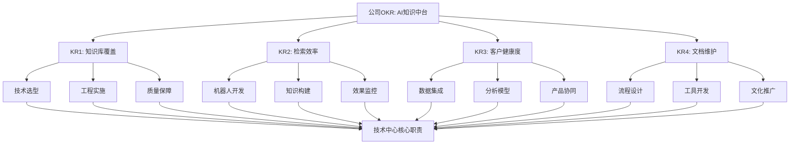

# 📋 公司OKR：产研主导基于AI的公司级别知识中台

## 🎯 目标（Objective）
**产研主导基于AI的公司级别知识中台，客户体验和CSM服务提效**

**解读：**
- **产研主导**：技术团队（产品+研发）是建设主体，需主动牵头
- **公司级别**：跨部门协同，非单团队工具，需考虑全公司数据与流程
- **知识中台**：核心是**知识管理+AI能力**，而非简单文档仓库
- **双重价值**：对内提效（产研）、对外增值（客户体验+CSM服务）

## 📊 四个关键结果（KRs）

### KR1：知识库覆盖
> 完成 100% 核心技术文档（API文档、架构设计图、过往事故复盘、PRD）的向量化处理，接入RAG（检索增强生成）系统。

**技术中心职责映射：**
- **技术选型**：向量数据库（Pinecone/Weaviate/Qdrant）、Embedding模型、RAG框架
- **工程实施**：文档爬取、清洗、向量化流水线
- **质量保障**：检索准确性、时效性、覆盖率指标
- **团队赋能**：开发团队文档规范、API对接指南

### KR2：检索效率
> 内部技术问答群的常见问题（FAQ）拦截率达到 60% 以上，由AI机器人自动准确回复，人工介入率低于40%。

**技术中心职责映射：**
- **机器人开发**：IM集成（企微/钉钉）、对话引擎、上下文管理
- **知识构建**：FAQ挖掘、问题分类、答案优化
- **效果监控**：拦截率、准确率、满意度指标体系
- **运维保障**：机器人SLA、故障恢复、性能优化

### KR3：客户运营健康度
> 客户运营的企微数据专区会话上线（小乐、小氪），综合客户后台登录，终端账号活跃，业绩健康度等判断，AI辅助做健康度分析。

**技术中心职责映射：**
- **数据集成**：客户数据平台（CDP）、行为数据、业务指标
- **分析模型**：健康度评分模型、预警规则、趋势分析
- **产品协同**：与CSM团队定义指标、设计分析界面
- **技术支撑**：实时计算、数据可视化、API开放

### KR4：文档维护
> 实施“文档即代码”策略，利用AI自动检测代码变更并提示/辅助更新相关文档。

**技术中心职责映射：**
- **流程设计**：代码-文档关联规范、变更触发机制
- **工具开发**：代码解析、文档影响分析、自动更新工具
- **文化推广**：开发者习惯培养、文档质量标准
- **持续优化**：反馈闭环、误报率降低、覆盖度提升

# 🔄 技术中心职责全景图

# 📅 本周工作与OKR对齐思考

基于[[周计划-2026-02-09]]，本周三项核心工作与OKR对齐如下：

## 1. 20+人1v1述职反馈 → **团队能力盘点与OKR准备**
**对齐点：**
- **技能评估**：了解团队当前在AI、向量化、RAG、机器人开发等领域的技能水平
- **意愿摸底**：收集团队对知识中台项目的态度、担忧、期望
- **角色识别**：发现潜在的项目核心成员、技术专家、变革推动者
- **培训需求**：识别技能缺口，为后续培训计划提供依据

**关键问题可融入反馈：**
- “你如何看待AI在知识管理中的应用前景？”
- “在文档向量化、智能问答机器人方面，你有什么经验或兴趣？”
- “如果参与知识中台项目，你希望承担什么角色？”

## 2. 周四技术讨论会 → **战略共识与方向对齐**
**对齐点：**
- **议题深化**：将“AI对定制能力、成本、人员结构的影响”具体化为：
  - **定制能力** → KR1知识库覆盖如何支持定制化需求
  - **成本** → KR2机器人如何降低人力成本，KR4文档维护如何减少技术债务
  - **人员结构** → 知识中台需要什么新角色（Prompt工程师、AI运维、数据标注）
- **资源协调**：明确技术中心在OKR中的资源需求（人力、算力、预算）
- **风险共识**：识别技术风险（向量化质量、机器人准确率）与管理风险（跨部门协作）

**会议引导可加入：**
- “从技术中心视角，四个KR的优先级和依赖关系是什么？”
- “我们需要建立哪些新的技术能力来支持这些KR？”
- “现有的开发流程需要如何调整以支持‘文档即代码’？”

## 3. Mac mini上OpenClaw部署 → **技术探索与可行性验证**
**对齐点：**
- **技术验证**：OpenClaw作为开源Agent框架，可探索其在KR2（问答机器人）和KR4（文档维护）中的应用潜力
- **知识库整合**：实践Obsidian知识库与AI Agent的集成，为KR1提供参考案例
- **技能积累**：通过动手实践，积累Agentic engineering经验，为后续项目储备技术能力
- **成本感知**：亲身体验Token消耗、部署复杂度，为成本估算提供真实数据

**实践重点：**
- OpenClaw能否作为内部技术问答机器人的基础框架？
- 如何将Obsidian文档库接入OpenClaw的Skill系统？
- Agent自主更新文档（KR4）的技术可行性？

# 🚀 技术中心OKR分解建议（草案）

基于公司OKR，建议技术中心制定如下分解目标：

## Objective：主导建设公司AI知识中台技术底座

### KR1.1：完成核心技术文档向量化架构设计
- **指标**：设计文档通过评审，POC验证通过
- **行动**：技术选型（3月）、POC开发（4月）、架构设计（5月）

### KR1.2：建立文档质量与覆盖率监控体系
- **指标**：核心文档覆盖率≥95%，向量化准确率≥90%
- **行动**：制定文档标准（3月）、开发监控工具（4月）、建立流程（5月）

### KR2.1：开发内部技术问答机器人MVP
- **指标**：企微集成完成，FAQ拦截率≥40%
- **行动**：需求分析（3月）、开发（4月）、试点运行（5月）

### KR2.2：建立机器人效果优化闭环
- **指标**：人工介入率≤50%，用户满意度≥4/5分
- **行动**：反馈收集机制（4月）、模型优化（5月）、流程固化（6月）

### KR3.1：构建客户健康度数据基础
- **指标**：核心数据源接入完成，数据模型V1.0
- **行动**：数据调研（3月）、模型设计（4月）、开发实施（5月）

### KR4.1：实施“文档即代码”试点项目
- **指标**：选定3个核心代码库，文档自动更新覆盖率≥70%
- **行动**：工具选型（3月）、试点开发（4月）、效果评估（5月）

# 🔍 关键决策点与风险分析

## 技术选型决策
1. **向量数据库**：云服务（Pinecone）vs 自建（Weaviate/Qdrant）
   - 权衡：成本 vs 控制力、运维复杂度 vs 灵活性
2. **Embedding模型**：通用模型（OpenAI）vs 领域微调
   - 权衡：效果 vs 成本、通用性 vs 专业性
3. **机器人框架**：自研 vs 开源（OpenClaw/Rasa）vs 商用
   - 权衡：定制能力 vs 开发成本、控制力 vs 迭代速度

## 组织协作风险
1. **跨部门协同**：CSM、产品、运营的数据与需求对齐
   - **缓解**：建立联合项目组，定期同步会
2. **团队技能缺口**：AI工程、Prompt工程、向量搜索等新技能需求
   - **缓解**：外部招聘+内部培训+试点项目实践
3. **文化阻力**：开发者对“文档即代码”的接受度
   - **缓解**：从小范围试点开始，展示价值，逐步推广

## 实施路径建议
**Phase 1：探索验证（Q1）**
- 技术调研、POC开发、团队能力建设
- 本周工作（反馈、会议、OpenClaw）是Phase 1的关键启动

**Phase 2：试点突破（Q2）**
- 选择1-2个高价值场景深度实施
- 建立核心能力，验证业务价值

**Phase 3：规模推广（Q3-Q4）**
- 扩展场景，优化流程，建立体系
- 达成年度OKR目标

# 💡 本周行动建议（基于周计划调整）

## 1. 述职反馈中增加OKR相关洞察
- **问题设计**：增加对公司AI知识中台OKR的看法与建议
- **技能映射**：记录每个人的相关技能（AI、文档、数据等）
- **角色建议**：基于反馈，为OKR项目推荐核心成员

## 2. 技术讨论会聚焦OKR落地路径
- **议题调整**：从“AI影响讨论”深化为“技术中心如何支撑公司AI知识中台OKR”
- **产出明确**：形成技术中心OKR分解草案、资源需求清单、风险应对策略
- **后续行动**：会议后立即启动Phase 1规划（技术选型、团队组建）

## 3. OpenClaw实践定向知识中台场景
- **场景选择**：重点测试文档问答、代码-文档关联等知识中台相关场景
- **经验提炼**：总结部署经验、成本数据、技术难点，为后续决策提供参考
- **能力传递**：将实践成果转化为团队培训材料

# 📚 相关资源与后续步骤

## 立即行动
1. **更新周计划**：在[[周计划-2026-02-09]]中强化OKR对齐思考
2. **准备会议材料**：将OKR内容融入周四讨论会PPT
3. **调整反馈问题**：在1v1反馈中加入OKR相关洞察收集

## 短期跟进（2周内）
1. **制定技术中心OKR分解**：基于本周洞察，形成正式分解文档
2. **启动Phase 1规划**：明确Q1技术选型、POC、团队建设计划
3. **建立跨部门沟通**：与CSM、产品团队初步对接需求

## 长期规划（1个月内）
1. **组建项目核心团队**：基于述职反馈结果，确定核心成员
2. **启动技术选型评审**：组织向量数据库、Embedding模型等选型评审
3. **制定培训计划**：针对团队技能缺口，制定AI工程、RAG等培训

---
**最后更新：2026-02-09**
**关联文档：** [[周计划-2026-02-09]] | [[Clawdbot (OpenClaw) 趋势分析与下一步建议]]
**下一步：** 基于本周工作成果，细化技术中心OKR分解与Phase 1实施计划