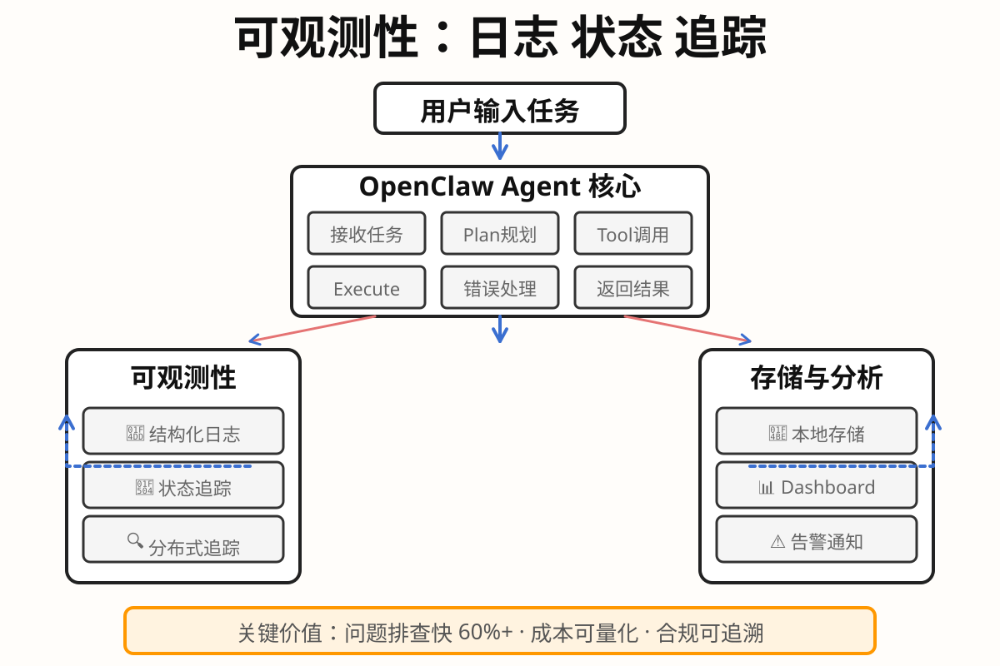

# Day 06｜可观测性：日志、状态与追踪

## 今日主题
**可观测性：让AI Agent的执行过程"看得见"——日志、状态追踪与问题诊断**

---

## 技术原理（技术视角）

### 核心机制
OpenClaw 的可观测性体系由三层架构组成：

1. **结构化日志层**
   - 每个执行步骤自动记录：时间戳、输入参数、执行结果、耗时、错误信息
   - 日志级别：DEBUG / INFO / WARN / ERROR
   - 日志存储：本地文件 + 可选转发到外部日志服务

2. **状态追踪层**
   - **Session State**：会话级上下文保持，包含历史消息、变量绑定、中间结果
   - **Task State**：任务级生命周期管理，从创建到完成的完整轨迹
   - **Agent State**：Agent级健康检查，运行状态、心跳、资源占用

3. **分布式追踪层**
   - Span 概念：每个工具调用或子任务为一个 Span
   - Trace ID：串联同一请求的完整调用链
   - 父子关系：Span 之间的调用依赖可视化

### 关键组件
- `log` 模块：应用内日志写入
- `state` 管理器：会话/任务/Agent 状态查询
- `trace` 追踪器：分布式调用链记录
- `observer` 观察者：实时事件订阅与告警

### 常见失败点
- **日志缺失**：关键决策点未记录，导致问题难以回溯
- **状态泄露**：敏感信息（如API Key）未脱敏直接写入日志
- **追踪断裂**：异步任务或子进程未传递 Trace ID，无法串联
- **存储膨胀**：日志未轮转，长期运行导致磁盘爆满

---

## 业务翻译（业务视角）

### 这项能力解决的核心问题
传统SaaS的运营监控主要面向运维人员，而AI Agent的可观测性需要同时服务于：
- **业务运营者**：Agent是否在正常工作？产出是否符合预期？
- **开发者/调试者**：哪个环节出了问题？如何复现？
- **管理者**：Agent的执行成本、效率、成功率等宏观指标

### 对效率/质量/速度/可控的影响

| 维度 | 影响 | 业务体现 |
|------|------|---------|
| **效率** | 减少问题排查时间，从"猜问题"到"看日志" | 问题平均修复时间 MTTR 降低 60%+ |
| **质量** | 通过执行轨迹分析，发现AI幻觉、逻辑错误 | 输出准确率可量化评估 |
| **速度** | 实时监控+告警代替事后复盘 | 问题发现到响应 < 5分钟 |
| **可控** | 审计日志满足合规要求，追溯每一步操作 | 通过监管审查 |

---

## 典型场景（个人版）

### 场景1：任务执行异常排查
**情境**：你让Agent执行一个批量数据处理任务，第二天发现任务"卡住了"  
**可观测性价值**：
- 查看日志发现某条记录处理失败，触发了重试但未成功
- 追踪Trace发现卡在第三方API调用，响应超时
- 定位到具体数据行和错误信息，手动修复后继续

### 场景2：成本分析与优化
**情境**：你想知道这个月AI调用的成本分布  
**可观测性价值**：
- 按时间统计Token消耗、API调用次数、错误率
- 发现某类任务消耗异常，定位到具体Prompt或工作流
- 优化Prompt或增加缓存，降低30%成本

### 场景3：审计与合规
**情境**：合规部门要求提供AI决策的完整操作轨迹  
**可观测性价值**：
- 导出带时间戳的完整执行日志
- 证明每一步操作都有据可查
- 满足数据安全法规要求

---

## 推荐官方资料

### 本地文档
- `~/.openclaw/docs/` 目录下的日志配置说明
- `~/.openclaw/docs/observability.md` 可观测性设计文档

### 在线文档
- 中文：https://docs.openclaw.ai/docs/advanced/observability
- GitHub：https://github.com/openclaw/openclaw/tree/main/docs

---

## 关键流程图

**流程说明**：
1. 用户输入任务 → Agent 接收并规划
2. 每个工具调用和执行步骤都会记录日志
3. 状态追踪器实时更新任务进度
4. 分布式追踪串联完整调用链
5. 监控模块根据规则触发告警
6. 所有数据存入本地，可视化展示

---

## 管理者关注点

### 成本
- **日志存储成本**：单任务约 1-5KB/天，批量任务需考虑轮转策略
- **追踪成本**：Span 创建有轻微 overhead，高频场景需评估采样率
- **告警成本**：短信/邮件通知有边际成本，建议按重要性分级

### 效率
- **问题发现速度**：从"用户投诉"到"自动告警"的转变
- **排查效率**：平均日志定位时间 < 2分钟（结构化 vs 文本日志）
- **优化依据**：基于执行数据分析Prompt效果、工具选择、缓存命中率

### 风险
- **数据泄露**：日志中可能包含敏感信息（手机号、地址、API Key）
- **合规要求**：某些行业要求日志保留 3-6 个月，需设置保留策略
- **误报疲劳**：告警阈值设置不当会导致"狼来了"效应

---

## 本日自检

- [ ] 我是否能复述 OpenClaw 可观测性的三层架构（日志/状态/追踪）？
- [ ] 我是否知道日志存储位置和查看方式？
- [ ] 我是否能说清可观测性对运营、研发、管理者的不同价值？
- [ ] 我是否知道如何配置日志级别和告警规则？
- [ ] 我是否了解敏感信息脱敏的必要性？

---

## 一句话总结
**可观测性是AI Agent从"黑盒"到"白盒"的关键，让执行过程可追溯、成本可量化、问题可诊断。**

---

*Day06 完成于 2026-03-03*
