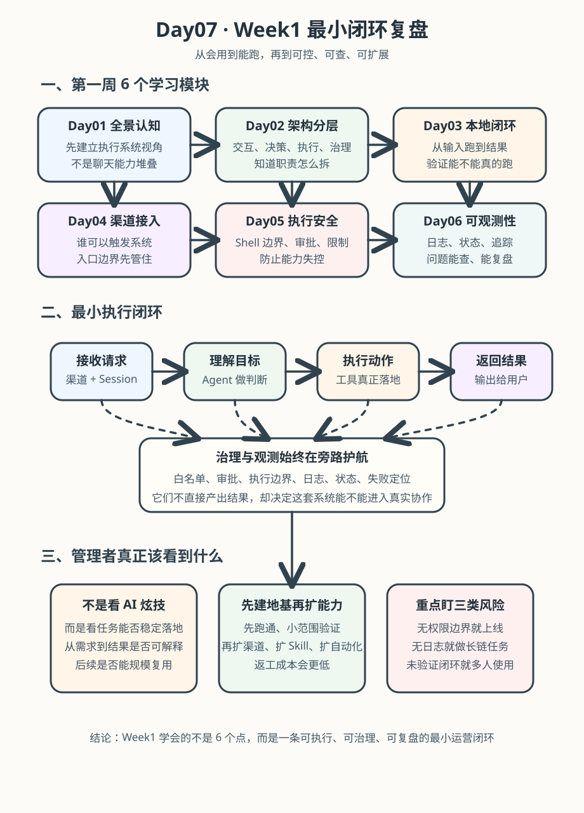

# Day 07｜Week1复盘：从会用到能跑

## 今日主题
把 Day01-06 学到的能力串成一条“可执行、可治理、可复盘”的最小闭环：
**从理解 OpenClaw 架构，到跑通本地任务，再到接入治理、执行安全和可观测。**

---

## 技术原理（技术视角）

### 1) Week1 的核心机制（不是知识点堆叠，而是能力链路）
- **认知层（Day01-02）**：知道“消息如何进入系统并转成动作”。
- **执行层（Day03）**：能在本地完成一次从输入到结果的最小可运行闭环。
- **接入层（Day04）**：知道多渠道接入时，白名单与身份边界怎么控制。
- **安全层（Day05）**：明确 Shell 执行边界，建立“能做什么/不能做什么”的底线。
- **观测层（Day06）**：用日志、状态、追踪把执行过程从黑盒变白盒。

### 2) 组件关系（按真实执行顺序）
1. 用户消息进入会话（Session）
2. Agent 进行理解、规划与工具选择
3. 工具执行（exec/browser/web 等）返回结果
4. 安全策略校验（权限/白名单/审批）
5. 可观测模块记录日志与状态，支持追溯与优化

### 3) Week1 常见误区
- **误区A：只追求“能跑通”**，忽略安全和审计，后续风险会放大。
- **误区B：只看结果，不看过程**，问题出现时无法定位根因。
- **误区C：把工具当功能清单**，没有按“端到端场景”组装成闭环。

---

## 业务翻译（业务视角）

### 这项能力解决什么问题
管理者最常见的问题不是“AI 能不能回答”，而是：
- 能否**稳定执行任务**？
- 能否**可控地调用外部能力**？
- 出问题后能否**快速定位和修复**？

Week1 的价值就是把这些问题从“感觉”变成“机制”。

### 为什么业务能理解并愿意使用
- 有流程：从输入到输出有清晰路径，不是玄学。
- 有边界：哪些动作可执行、哪些需要审批，一眼可知。
- 有证据：日志和状态可追溯，便于复盘和对齐责任。

### 提效 / 提质 / 提速 / 可控价值
- **提效**：减少人工串联工具与重复沟通。
- **提质**：通过结构化执行降低遗漏与误操作。
- **提速**：问题定位从“猜”变“查”，缩短恢复时间。
- **可控**：安全边界、审计记录、回溯链路同时具备。

---

## 典型场景（个人版）
1. **个人运营助手上线前验收**：按 Week1 闭环检查“能跑、可控、可查”。
2. **跨渠道消息接入**：先定白名单和权限，再放开自动执行。
3. **异常复盘会**：用日志 + Trace 说明问题发生点和修复动作。

---

## 官方资料（带看点）

### 本地文档（知识库镜像路径，优先）
- [[03-Resources/效率工具/OpenClaw-30天学习手册/官方文档-本地镜像(节选)/concepts__architecture.md]]  
  看点：系统分层和组件关系，适合建立整体心智模型。  
- [[03-Resources/效率工具/OpenClaw-30天学习手册/官方文档-本地镜像(节选)/concepts__messages.md]]  
  看点：消息对象与处理链路，是“输入变动作”的基础。  
- [[03-Resources/效率工具/OpenClaw-30天学习手册/官方文档-本地镜像(节选)/start__quickstart.md]]  
  看点：最小闭环跑通路径，适合快速验证环境。  
- [[03-Resources/效率工具/OpenClaw-30天学习手册/官方文档-本地镜像(节选)/tools__exec.md]]  
  看点：执行工具能力与边界，理解风险控制入口。  
- [[03-Resources/效率工具/OpenClaw-30天学习手册/官方文档-本地镜像(节选)/tools__browser.md]]  
  看点：浏览器自动化能力定位，帮助评估后续扩展场景。

### 在线文档
- https://docs.openclaw.ai/docs/concepts/architecture
- https://docs.openclaw.ai/docs/concepts/messages
- https://docs.openclaw.ai/docs/start/quickstart
- https://docs.openclaw.ai/docs/tools/exec
- https://docs.openclaw.ai/docs/tools/browser
- https://github.com/openclaw/openclaw/tree/main/docs

---

## 图示

图示阅读建议：先看上排基础能力，再看中排治理与观测，最后落到“可复制运营闭环”。

---

## 管理者关注点（成本 / 效率 / 风险）
- **成本**：第一周投入主要在认知和流程搭建，目标是避免后续返工成本。
- **效率**：闭环完整后，重复任务可标准化，协作链路更短。
- **风险**：若跳过权限、白名单、审计，短期快，长期事故概率高。

---

## 本日自检
1. 我能否用 3 分钟讲清“Week1 五层能力链路”？
2. 我是否知道“跑通”和“可治理”的差别？
3. 我是否能给出一个自己场景下的闭环验收清单？

---

## 一句话总结
**Week1 的成果不是学了 6 个知识点，而是拿到了一条“能跑、可控、可复盘”的 OpenClaw 最小运营闭环。**
