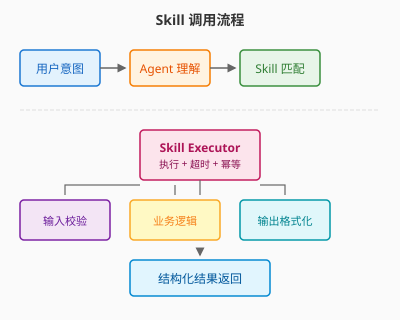

# Day 08｜Skill机制总览与开发入口

## 今日主题

理解 OpenClaw 的 Skill 机制：如何通过 Skill 扩展平台能力，将散点工具封装为可复用、可治理的业务能力单元。

## 技术原理（技术视角）

### 核心机制

Skill（技能）是 OpenClaw 的**能力封装单元**。它将一段逻辑（可以是 API 调用、脚本执行、数据处理等）封装为标准化接口，供 Agent 在对话中调用。

```
用户意图 → Agent 理解 → Skill 调用 → 返回结果 → Agent 整合 → 输出给用户
```

关键特征：
- **声明式定义**：通过 YAML/JSON 定义输入 Schema 和输出 Schema
- **自包含逻辑**：Skill 内部逻辑与外部解耦
- **可被发现**：Agent 可根据意图自动匹配可用 Skill
- **可组合**：多个 Skill 可串联形成工作流

### 关键组件

1. **Skill Definition（定义文件）**
   - `name`: 技能名称
   - `description`: 描述（Agent 理解技能用途的关键）
   - `input_schema`: 输入参数规范
   - `output_schema`: 输出结果规范
   - `handler`: 具体执行逻辑（路径引用）

2. **Skill Loader（加载器）**
   - 扫描指定目录加载 Skill 定义
   - 验证 Schema 合法性
   - 注册到 Agent 可用技能列表

3. **Skill Executor（执行器）**
   - 接收参数 → 执行业务逻辑 → 返回结构化结果
   - 处理超时、错误、幂等等问题

### 常见失败点

| 失败场景 | 原因 | 解决思路 |
|---------|------|---------|
| Agent 找不到 Skill | description 不清晰 或 未被加载 | 优化描述、确认目录配置 |
| 输入参数校验失败 | input_schema 与实际不匹配 | 严格对齐 Schema |
| 执行超时 | 耗时操作未设置合理超时 | 拆分任务或增加超时配置 |
| 输出格式不符预期 | output_schema 定义错误 | 按业务返回实际结构定义 |

## 业务翻译（业务视角）

### 这项能力解决的核心问题

**散点工具无法复用 → 标准化能力单元**

在没有 Skill 机制之前：
- 每个需求都需要单独写逻辑
- 工具分散，难以维护
- Agent 无法自主发现和使用能力

有了 Skill 机制后：
- 一次封装，多次调用
- 能力可视化（Agent 知道有什么可用）
- 职责边界清晰（每个 Skill 专注一件事）

### 对效率/质量/速度/可控的影响

- **效率**：从"每次重写"到"调用即用"，复用率提升
- **质量**：标准化 Schema 约束输入输出，减少格式错误
- **速度**：Agent 自动匹配Skill，减少人工编排
- **可控**：Skill 可独立审批、监控、版本管理

## 典型场景（个人版）

1. **天气查询 Skill**
   - 输入：城市名
   - 输出：温度、天气状况、建议
   - Agent 在对话中可直接调用："明天上海天气怎么样？"

2. **日程管理 Skill**
   - 输入：事件标题、时间、参与人
   - 输出：创建结果或冲突提醒
   - 配合日历 Skill 实现"帮我安排下午3点会议"

3. **代码审查 Skill**
   - 输入：PR 链接
   - 输出：审查意见、风险点、建议
   - 开发者直接对话获取反馈

## 官方资料（带看点）

### 本地文档

- [[官方文档-本地镜像(节选)/03-Skill机制]] - 看点：Skill 的核心概念和定义方式
- [[官方文档-本地镜像(节选)/04-Skill开发实战]] - 看点：从零开发第一个 Skill 的完整步骤
- [[本地文档索引]] - 查看所有本地镜像文档目录

### 在线文档

- [Skill 机制概述](https://docs.openclaw.ai/concepts/skill) - 官方概念解读
- [Skill 开发指南](https://docs.openclaw.ai/guide/skill-develop) - 快速上手教程
- [Skill 示例库](https://github.com/openclaw/openclaw/tree/main/examples/skills) - 开箱即用的 Skill 示例

## 图示

### Skill 调用流程



## 管理者关注点（成本/效率/风险）

| 维度 | 关注点 |
|------|-------|
| **成本** | Skill 开发有一次性投入，后续复用边际成本趋零；需评估封装投入是否值得（复用频次≥3次建议封装） |
| **效率** | 好的 Skill 设计可让 Agent 自主完成复杂任务，减少人工介入；重点关注高频场景的 Skill 沉淀 |
| **风险** | Skill 权限需分级控制；敏感操作（删除、发消息）需审批；建议建立 Skill 审核机制 |

## 本日自检

1. 我是否能说清 Skill 和普通工具/脚本的区别？
2. 我是否理解了 Skill 的核心四要素：name、description、input_schema、output_schema？
3. 我是否能描述一个适合封装为 Skill 的业务场景？

## 一句话总结

**Skill 是 OpenClaw 的能力单元标准化机制——让散点工具变成可被发现、可被复用、可被治理的业务能力。**
