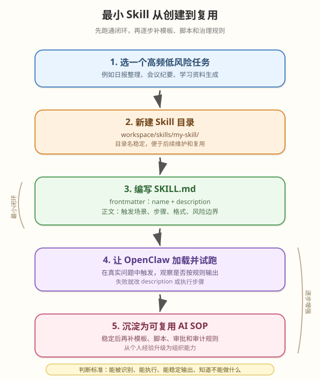

# Day 09｜复刻第一个 Skill（最小可用）

## 今日主题

今天不追求“写一个复杂能力”，只完成一件事：复刻一个最小可用 Skill，理解 OpenClaw 如何把一段稳定的操作经验沉淀成可重复调用的能力。

这里的 Skill，不是传统意义上的插件工程，也不是一定要写完整后端服务。它更像一份“能力说明书”：告诉 Agent 在什么场景下应该使用这项能力、该读哪些资料、该调用哪些已有工具、哪些动作必须谨慎。最小可用版本只需要一个目录和一个 `SKILL.md`，必要时再补充脚本、模板、示例文件。

学完今天，你要能回答三个问题：

1. 一个最小 Skill 到底由什么组成？
2. OpenClaw 如何发现并加载这个 Skill？
3. 为什么管理者要把高频经验沉淀成 Skill，而不是一直靠口头说明？

## 技术原理（技术视角）

### 1. Skill 的本质：给 Agent 的可执行上下文

OpenClaw 的 Skill 采用 AgentSkills 兼容结构。最核心的文件是：

```text
hello-world/
└── SKILL.md
```

`SKILL.md` 分成两层：

- **YAML frontmatter**：声明 Skill 名称、描述、加载条件等元信息。
- **Markdown 正文**：写清楚触发场景、执行步骤、注意事项、可引用的脚本或模板。

最小版本示例：

```markdown
---
name: hello-world
description: 当用户要求生成简短问候语或测试自定义 Skill 是否生效时使用。
---

# Hello World Skill

当用户要求测试 Skill 时，输出一句简短问候，并说明这是来自自定义 Skill 的响应。

执行要求：
- 使用中文。
- 不访问外部系统。
- 不保存用户隐私信息。
```

这个 Skill 没有单独的 `handler.js`，也没有额外 API。它依靠说明文档让 Agent 在合适场景下采用稳定做法。后续如果需要真正调用脚本，可以在 Skill 目录中加入 `scripts/`、`templates/`、示例数据等资源，并在 `SKILL.md` 中说明如何使用。

### 2. OpenClaw 如何加载 Skill

OpenClaw 会从多个位置加载 Skill，常见优先级如下：

1. **Workspace skills**：`<workspace>/skills`，优先级最高，适合当前工作区专属能力。
2. **Managed/local skills**：`~/.openclaw/skills`，适合本机多个 Agent 共享。
3. **Bundled skills**：OpenClaw 随安装包自带的通用能力。
4. **extraDirs**：通过配置额外指定的 Skill 目录，优先级较低。

如果同名 Skill 在多个目录都存在，工作区版本会覆盖本地共享版本，本地共享版本会覆盖内置版本。这一点很重要：团队可以先用公共 Skill 打底，再在具体项目工作区中做轻量定制。

### 3. `SKILL.md` 的最小字段

最小 frontmatter 必须包含：

```markdown
---
name: daily-summary
description: 当用户要求整理每日工作总结、复盘或行动项时使用。
---
```

字段设计要点：

- `name`：稳定、简短、不要频繁改名。建议使用小写英文和连字符。
- `description`：决定模型是否会选中这个 Skill，要写清楚“什么时候用”，不要只写“这是一个很强大的工具”。
- 正文：写执行步骤、输出结构、边界条件、失败处理方式。

一个实用的 Skill 正文通常包含：

```markdown
# Daily Summary Skill

## Use when
- 用户要求写日报、周报、复盘、行动项。
- 用户给出零散记录，希望整理成管理层可读版本。

## Output format
1. 结论
2. 今日完成
3. 风险与阻塞
4. 明日动作

## Rules
- 不编造未提供的数据。
- 涉及外部发送前必须让用户确认。
- 语气要适合直接转发。
```

### 4. 从“说明文档”到“可复用能力”的路径

一个 Skill 可以逐步演进，不需要一开始就复杂化：

1. **说明型 Skill**：只有 `SKILL.md`，固化流程、格式、注意事项。
2. **模板型 Skill**：增加 `templates/`，把常用输出模板独立出来。
3. **脚本型 Skill**：增加 `scripts/`，让 Agent 在需要时调用本地脚本处理数据。
4. **工具型 Skill**：结合外部 CLI、API、MCP 或浏览器自动化，形成更完整能力。
5. **治理型 Skill**：加入权限说明、审批边界、审计要求和错误恢复策略。

最小可用的关键不是“功能少”，而是“闭环完整”：能被识别、能被执行、能稳定产出、能知道不能做什么。

### 5. 常见误区

| 误区 | 问题 | 正确做法 |
|---|---|---|
| 一上来写复杂代码 | 调试成本高，价值还没验证就进入工程细节 | 先用 `SKILL.md` 固化流程，再决定是否脚本化 |
| description 写得太泛 | Agent 不知道什么时候该用 | 写清楚触发场景和用户表达 |
| 只写步骤不写边界 | 容易误发、误删、误调外部系统 | 明确哪些动作要确认、哪些信息不能外泄 |
| Skill 名称频繁变化 | 历史引用和使用习惯会断裂 | 名称稳定，迭代正文和模板 |
| 把 Skill 当知识库文章 | 只解释概念，不能指导执行 | 必须包含可执行步骤和输出约束 |

## 业务翻译（业务视角）

### 这项能力解决什么问题

Skill 解决的是“组织经验无法稳定复用”的问题。

没有 Skill 时，团队经常依赖个人经验：某个人知道日报怎么写、知道线上问题怎么复盘、知道浏览器自动化失败时怎么恢复。但这些经验如果只存在脑子里，每次换人、换场景、换 Agent 都要重新讲一遍。

有了 Skill，就可以把经验沉淀成一份可被 Agent 读取和执行的操作说明：

- 什么情况触发；
- 用什么资料；
- 按什么步骤做；
- 输出什么格式；
- 哪些动作必须确认；
- 失败时如何降级。

这就是从“人会做”变成“组织可复用”。

### 为什么业务能理解并愿意使用

业务不需要理解 Skill 的内部实现，只需要知道它带来的三个变化：

1. **同类任务输出更稳定**：日报、周报、复盘、调研报告不再每次风格漂移。
2. **新人上手更快**：新人不用反复问“这个怎么写”，Skill 已经把标准流程写好。
3. **管理动作更可控**：哪些能自动做，哪些必须确认，可以提前写进规则。

对管理者来说，Skill 是 AI 时代的 SOP。传统 SOP 给人看，Skill 同时给人和 Agent 看。

### 提效、提质、提速、可控价值

- **提效**：高频任务不用每次重新解释背景和格式。
- **提质**：输出标准统一，减少遗漏关键字段。
- **提速**：从“先沟通半小时”变成“直接按 Skill 执行”。
- **可控**：风险边界写在 Skill 中，外部发送、删除、敏感数据处理都能先卡住。

## 典型场景（个人版）

1. **每日学习资料生成**
   - 触发：每天固定时间生成下一篇学习资料。
   - Skill 内容：目录路径、文件命名、正文结构、图示规范、通知规则。
   - 价值：把学习计划从一次性文档变成持续产出机制。

2. **会议纪要整理**
   - 触发：用户贴一段会议记录或语音转写。
   - Skill 内容：按“结论、决策、行动项、风险、待确认”输出。
   - 价值：降低会后整理成本，让纪要直接进入执行。

3. **周问题复盘**
   - 触发：每周整理 Bug、告警和风险闭环。
   - Skill 内容：数据来源、统计口径、管理层版本、发送前确认规则。
   - 价值：把复盘从“统计列表”升级为“治理动作”。

4. **浏览器自动化任务恢复**
   - 触发：网页登录、抓取、表单操作、引用失效。
   - Skill 内容：先检查标签页、再快照、再定位元素、失败后降级。
   - 价值：减少自动化中断，提高长流程稳定性。

## 官方资料（带看点）

### 本地文档（知识库镜像路径）

- [[官方文档-本地镜像(节选)/tools__skills]] - 看点：Skill 的加载位置、优先级、frontmatter 格式、gating 规则。
- [[官方文档-本地镜像(节选)/tools__creating-skills]] - 看点：从创建目录到编写 `SKILL.md` 的最小实践流程。
- [[官方文档-本地镜像(节选)/tools__subagents]] - 看点：当 Skill 需要拆分长任务时，如何配合子 Agent 执行。
- [[本地文档索引]] - 看点：快速定位 OpenClaw 本地镜像文档。

### 在线文档

- [OpenClaw Skills](https://docs.openclaw.ai/tools/skills) - Skill 目录、加载优先级、AgentSkills 兼容格式说明。
- [Creating Custom Skills](https://docs.openclaw.ai/tools/creating-skills) - 创建第一个自定义 Skill 的官方入门说明。
- [AgentSkills](https://agentskills.io) - AgentSkills 规范入口，用于理解跨 Agent 的 Skill 结构。
- [OpenClaw GitHub](https://github.com/openclaw/openclaw) - 项目源码与示例参考。

## 图示

### 最小 Skill 从创建到复用的闭环



## 管理者关注点（成本/效率/风险）

| 维度 | 关注点 |
|---|---|
| 成本 | 第一个最小 Skill 的成本主要是梳理流程和边界，通常不需要复杂开发；建议从高频、低风险、格式稳定的任务开始。 |
| 效率 | Skill 能减少重复解释，让 Agent 每次都按同一套标准执行；越高频的任务，复用收益越明显。 |
| 风险 | 不要把敏感信息、内部账号、密钥写进 Skill；涉及外部发送、删除、审批、付费动作时，必须写明确认规则。 |
| 治理 | Skill 本质是组织级 AI SOP，需要有人维护版本、淘汰过时规则、沉淀失败经验。 |
| 规模化 | 当多个团队都开始写 Skill 时，要建立命名、目录、审核、安全检查和复盘机制，避免能力散落。 |

## 本日自检

1. 我是否能解释：为什么最小 Skill 只需要一个目录和一个 `SKILL.md`？
2. 我是否能写出一个包含 `name`、`description` 和执行规则的最小 Skill？
3. 我是否知道 Workspace skills、Managed/local skills、Bundled skills 的优先级区别？
4. 我是否能判断一个高频任务是否适合先做成说明型 Skill？
5. 我是否会在 Skill 中写清楚外部发送、敏感数据、删除操作等风险边界？

## 一句话总结

最小 Skill 不是“小功能”，而是把一次经验变成可重复执行的 AI SOP：先用 `SKILL.md` 跑通闭环，再逐步补模板、脚本和治理规则。
