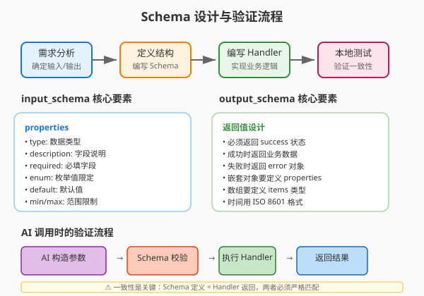

# Day 10｜输入输出 Schema 设计与一致性

## 今日主题

深入理解 OpenClaw Skill 的输入输出 Schema 设计原则——如何定义清晰的接口契约，确保 AI Agent 与业务系统之间的数据交互稳定可靠。

## 技术原理（技术视角）

### 什么是 Schema

Schema（模式）是技能的"接口契约"，定义了：
- **输入（input_schema）**：AI 可以传什么参数给 Skill
- **输出（output_schema）**：Skill 返回什么格式的数据

它类似于 API 的请求/响应格式定义，是 AI 与工具之间的"普通话"。

### input_schema 核心字段

```yaml
input_schema:
  type: object                          # 顶级类型必须是 object
  properties:                           # 可接收的参数列表
    target_user:
      type: string                     # 数据类型：string/number/boolean/array/object
      description: "要发送消息的目标用户"  # 描述供 AI 理解参数含义
      minLength: 1                     # 字符串最小长度
    message_content:
      type: string
      maxLength: 2000                  # 字符串最大长度（防止过长）
    urgent:
      type: boolean
      default: false                   # 默认值
    tags:
      type: array
      items:
        type: string                   # 数组元素类型
  required: ["target_user", "message_content"]  # 必填字段
```

### output_schema 核心字段

```yaml
output_schema:
  type: object
  properties:
    success:
      type: boolean
      description: "操作是否成功"
    message_id:
      type: string
      description: "发送成功后的消息ID"
    error:
      type: object
      description: "失败时的错误信息"
      properties:
        code:
          type: string
        detail:
          type: string
  required: ["success"]                # 至少要返回 success 状态
```

### 数据类型体系

| 类型 | 用途 | 示例 |
|------|------|------|
| string | 文本内容 | 用户名、消息正文 |
| number | 数值 | 价格、数量、页码 |
| boolean | 是/否 | 是否加急、是否公开 |
| array | 列表 | 标签列表、选项列表 |
| object | 嵌套结构 | 错误对象、联系信息 |
| enum | 枚举值 | 状态枚举（下单/已发货/已完成） |

### 一致性保证机制

1. **Schema 校验**：输入不符合 schema 时直接拒绝，AI 会收到明确的错误提示
2. **类型推断**：清晰的 schema 帮助 AI 理解如何构造正确的输入
3. **版本演化**：schema 变更可通过版本号追踪，兼容旧版本

### 常见失败点

| 失败场景 | 原因 | 解决思路 |
|---------|------|---------|
| AI 传了未定义的字段 | properties 未覆盖所有场景 | 补全 properties 或使用 additionalProperties: true |
| 返回格式与 schema 不匹配 | handler 返回结构与 output_schema 不一致 | 严格按 schema 返回，缺字段要补 null |
| 必填字段缺失导致校验失败 | required 列表不完整或 AI 遗漏 | required 只列真正必填，提供默认值 |
| 枚举值不匹配 | enum 定义与实际值不一致 | 确保 enum 值是业务真实可能值 |

## 业务翻译（业务视角）

### 为什么 Schema 如此重要

**它是 AI 与业务系统对话的"桥梁"**

- **没有 Schema**：AI 随意传参数，系统可能崩溃
- **有 Schema**：AI 知道什么能传、什么不能传、传了会得到什么

### 对效率/质量/速度/可控的影响

- **效率**：清晰 Schema 减少 AI 试错次数，一次调用成功率高
- **质量**：标准化输出便于后续解析和处理，减少业务 Bug
- **速度**：明确的接口约定减少沟通成本，开发对接更快
- **可控**：Schema 版本管理让系统演进可追溯，风险可控

### 谁应该关心 Schema 设计

- **Skill 开发者**：必须清晰定义自己 Skill 的接口
- **AI 编排者**：需要理解各 Skill 的接口才能正确组合
- **业务负责人**：审核 Schema 是否覆盖业务需求

## 典型场景（个人版）

### 场景一：日程创建 Skill

- **输入**：title（标题）、start_time（开始时间）、duration（时长）、attendees（参与人列表）
- **输出**：event_id（事件ID）、join_link（会议链接）、confirmation（确认状态）
- **要点**：时间格式要用 ISO 8601， attendees 是数组

### 场景二：文件搜索 Skill

- **输入**：keyword（关键词）、file_type（文件类型，可选）、max_results（最大结果数）
- **输出**：results（结果列表，每个包含 name/path/size/modified）
- **要点**：max_results 要有上限防止返回过多

### 场景三：订单查询 Skill

- **输入**：order_id（订单号）或 phone（手机号）
- **输出**：order_status、items（商品列表）、total_amount、shipping_info
- **要点**：输入可以是二选一，用 enum 或 oneOf 实现

## 官方资料（带看点）

### 本地文档

- [[官方文档-本地镜像(节选)/tools__skills]] - 看点：Skill 定义文件中 Schema 字段的完整说明
- [[官方文档-本地镜像(节选)/concepts__messages]] - 看点：消息体与命令体的结构区分
- [[本地文档索引]] - 查看所有本地镜像文档目录

### 在线文档

- [Skill YAML 定义参考](https://docs.openclaw.ai/tools/skills#format-agentskills--pi-compatible) - 完整的 frontmatter 和 Schema 字段说明
- [JSON Schema 规范](https://json-schema.org/) - 深入理解类型系统的官方参考
- [OpenClaw Examples](https://github.com/openclaw/openclaw/tree/main/examples/skills) - 多种 Schema 设计的示例参考

## 图示

### Schema 设计与验证流程



## 管理者关注点（成本/效率/风险）

| 维度 | 关注点 |
|------|-------|
| **成本** | Schema 设计初期需要 15-30 分钟梳理业务参数，但后续维护成本低；建议复用现有 API 的接口定义 |
| **效率** | 好的 Schema 可让 AI 一次调用成功率提升 50%+，减少重试和人工干预 |
| **风险** | Schema 变更要向后兼容，重大变更需要通知调用方；敏感字段（如密码）不要出现在 Schema 中 |

## 本日自检

1. 我是否能独立设计一个业务场景的 input_schema 和 output_schema？
2. 我是否理解每种数据类型（string/number/boolean/array/object）的适用场景？
3. 我是否能说出一个因为 Schema 不清晰导致的实际问题是怎样的？

## 一句话总结

**Schema 是 AI 与系统的接口契约——设计时多花 10 分钟，开发时少调 10 次错。**
