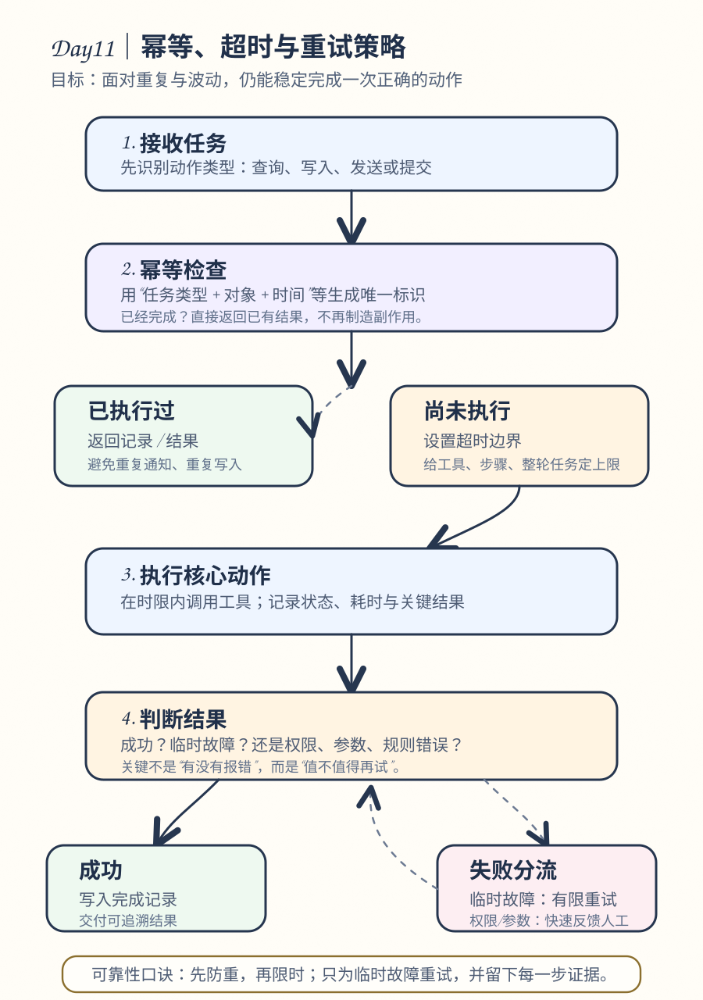

# Day 11｜幂等、超时与重试策略

## 今日主题

深入理解 OpenClaw 任务执行的可靠性保障机制——如何通过幂等设计、超时控制和重试策略，确保自动化任务在真实环境中稳定运行，即使面对网络抖动、系统延迟或临时故障也能优雅恢复。

## 技术原理（技术视角）

### 什么是幂等性

**幂等（Idempotent）**：同一操作执行多次的结果与执行一次相同。

| 操作类型 | 幂等性 | 示例 |
|---------|-------|------|
| 查询 | 天然幂等 | 查询订单状态，查100次结果不变 |
| 创建 | 非幂等 | 创建订单，调用10次可能创建10个订单 |
| 更新 | 视情况 | "设置状态为已发货"是幂等的，"增加库存"不是 |
| 删除 | 视情况 | "删除指定订单"通常幂等，"删除最新订单"不是 |

### OpenClaw 中的幂等实现

```yaml
skill:
  name: "order-query"
  idempotent_key: "order_id"    # 幂等键：相同 order_id 只执行一次
  input_schema:
    type: object
    properties:
      order_id:
        type: string
        description: "订单号（幂等键）"
```

**核心策略**：
1. **唯一键约束**：使用业务唯一标识（如 order_id、user_id）作为幂等键
2. **去重表**：记录已处理的请求 ID，处理前先查询
3. **状态机**：操作前检查当前状态，避免重复执行

### 超时机制

**为什么需要超时**：
- 网络请求可能卡死
- 外部系统可能响应缓慢
- 无限等待会阻塞整个任务队列

```yaml
skill:
  name: "http-request"
  timeout: 30                  # 单次请求超时 30 秒
  retry:
    max_attempts: 3            # 最多重试 3 次
    backoff: "exponential"     # 指数退避
    initial_delay: 1           # 首次延迟 1 秒
    max_delay: 60              # 最大延迟 60 秒
```

### 重试策略

| 策略 | 描述 | 适用场景 |
|------|------|---------|
| 立即重试 | 失败后立刻重试 | 瞬时网络抖动 |
| 固定延迟 | 每次等固定秒数后重试 | 可预估的临时故障 |
| 指数退避 | 1s → 2s → 4s → 8s... | 避免对故障系统造成更大压力 |
| 抖动（jitter） | 退避时间加随机偏移 | 防止多客户端同时重试造成"惊群" |

**重试最佳实践**：
```yaml
retry:
  max_attempts: 3
  backoff: "exponential"
  jitter: true                 # 推荐开启，防止雷鸣般的重试
  retry_on:                   # 只对这些错误重试
    - "timeout"
    - "connection_error"
    - "5xx_server_error"
  # 不要重试这些
  do_not_retry:
    - "400_bad_request"
    - "401_unauthorized"
    - "404_not_found"
```

### 组件关系

```
用户触发 → Skill 执行 → 检查幂等键 → [已存在] → 返回缓存结果
                        ↓
                   [不存在] → 执行核心逻辑 → 记录幂等键 → 返回结果
                        ↓
                   [执行失败] → 判断是否可重试 → [是] → 等待后重试
                        ↓                                       ↓
                   [否] → 返回错误 ←───────────────────────────┘
```

### 常见误区

| 误区 | 真相 |
|------|------|
| "重试次数越多越好" | 重试会放大故障，重试 3 次仍失败应快速失败而非无限重试 |
| "超时设置越长越安全" | 超时过长会拖垮整个任务链，建议根据业务 SLA 设定 |
| "所有错误都要重试" | 400 错误（参数错误）重试也没用，5xx 才值得重试 |
| "幂等 = 事务" | 幂等只保证结果一致，事务保证原子性，两者不同 |

## 业务翻译（业务视角）

### 为什么可靠性机制如此重要

**没有可靠性保障的自动化 = 定时炸弹**

- **财务场景**：支付请求超时未重试 → 钱没付但用户以为付了
- **库存场景**：扣库存请求重试多次 → 超卖
- **通知场景**：重复发送短信 → 用户投诉

### 对效率/质量/速度/可控的影响

- **效率**：好的重试机制让任务自动恢复，减少人工干预
- **质量**：幂等设计防止数据重复或不一致
- **速度**：合理的超时让慢请求快速失败，不卡住整个流程
- **可控**：可观测的重试日志让问题可追溯

### 谁应该关心这些机制

- **Skill 开发者**：必须为写操作设计幂等键
- **运维人员**：监控重试率和超时情况
- **业务负责人**：评估故障影响，制定降级策略

## 典型场景（个人版）

### 场景一：定时报告发送

- **问题**：cron 任务因网络抖动失败，重试可能重复发送报告
- **解决**：使用"报告日期+类型"作为幂等键，同一天同一类型只发一次

### 场景二：API 调用超时

- **问题**：调用外部 CRM API 超时
- **解决**：设置 30 秒超时，失败后指数退避重试 3 次

### 场景三：Webhook 回调

- **问题**：支付回调因服务重启丢失
- **解决**：回调处理使用唯一事件 ID 幂等，重复回调只处理一次

## 官方资料（带看点）

### 本地文档

- [[官方文档-本地镜像(节选)/tools__skills]] - 看点：Skill 定义中的 timeout 和 retry 字段说明
- [[官方文档-本地镜像(节选)/concepts__execution]] - 看点：任务执行引擎如何处理超时和重试
- [[本地文档索引]] - 查看所有本地镜像文档目录

### 在线文档

- [Skill 执行配置](https://docs.openclaw.ai/tools/skills#execution-config) - timeout 和 retry 参数详解
- [错误处理最佳实践](https://docs.openclaw.ai/concepts/error-handling) - 如何设计健壮的错误处理
- [OpenClaw GitHub - Examples](https://github.com/openclaw/openclaw/tree/main/examples/skills) - 含幂等设计的 Skill 示例

## 图示

### 幂等、超时与重试流程



## 管理者关注点（成本/效率/风险）

| 维度 | 关注点 |
|------|-------|
| **成本** | 重试会消耗额外资源，建议设置上限（通常 3 次）；幂等键存储有轻微存储成本，但远低于数据不一致的修复成本 |
| **效率** | 指数退避比固定间隔更优，建议开启 jitter；合理的超时设置让系统快速失败而非无限等待 |
| **风险** | 金融类操作必须幂等；重试可能放大故障（如外部系统已超载），需设置熔断阈值；超时设置过长会导致任务堆积 |

## 本日自检

1. 我是否能说清楚"幂等"是什么意思，并能举出一个生活中的例子？
2. 我是否理解为什么重试需要"退避"而非立即重试？
3. 我是否知道什么样的错误应该重试、什么样的不应该？

## 一句话总结

**幂等是"做多次等于做一次"，超时是"等太久就放弃"，重试是"失败后再试一次"——三者配合才能打造可靠的自动化任务。**
