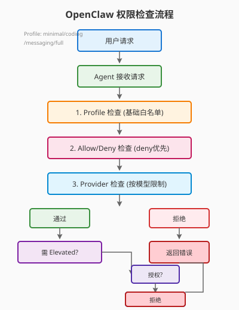

# Day 12｜权限分级与审批流设计

## 今日主题

深入理解 OpenClaw 的权限控制体系——如何通过工具级别权限、Agent 隔离和审批机制，确保 AI Agent 在可控范围内执行操作，既能发挥自动化能力，又不会变成"脱缰野马"。

## 技术原理（技术视角）

### 权限控制的三层架构

OpenClaw 的权限控制分为三个层级：

| 层级 | 控制粒度 | 典型配置位置 |
|------|---------|-------------|
| **全局层** | 所有 Agent 的默认行为 | `tools.allow` / `tools.deny` |
| **Agent 层** | 单个 Agent 的行为 | `agents.list[].tools` |
| **Provider 层** | 按模型供应商限制 | `tools.byProvider` |

### 核心机制一：工具允许/拒绝列表

```yaml
# openclaw.json
tools:
  deny: ["browser"]           # 禁用浏览器工具
  allow: ["exec", "message"]  # 明确允许这两个
```

**匹配规则**：
- 匹配规则不区分大小写
- 支持通配符 `*`（如 `deny: ["group:runtime"]` 拒绝所有运行时工具）
- `deny` 优先级高于 `allow`（即如果同时允许和拒绝，拒绝生效）

### 核心机制二：工具配置集（Profile）

预定义的安全配置集，**开箱即用**：

| Profile | 包含工具 | 适用场景 |
|---------|---------|---------|
| `minimal` | 仅 `session_status` | 纯对话 Agent |
| `coding` | `group:fs`, `group:runtime`, `group:sessions`, `group:memory`, `image` | 代码开发 Agent |
| `messaging` | `group:messaging`, `sessions_list`, `sessions_history`, `sessions_send` | 客服/消息回复 Agent |
| `full` | 无限制 | 完全信任的 Agent |

```yaml
# 全局默认 messaging，加 Agent 特定配置
tools:
  profile: "messaging"           # 全局默认
  allow: ["slack", "discord"]    # 额外允许
  agents:
    list:
      - id: "support"
        tools:
          profile: "messaging"
          allow: ["web_fetch"]   # 客服可以查资料
```

### 核心机制三：Provider 级别限制

针对不同模型供应商设置不同权限——即使同一个 Agent，用不同模型跑时权限也不同：

```yaml
tools:
  profile: "coding"
  byProvider:
    "google-antigravity":        # Google 模型专用配置
      profile: "minimal"         # 强制 minimal
    "openai/gpt-5.2":            # 特定模型版本
      deny: ["exec"]             # 禁用 exec
```

### 核心机制四：Sandbox 隔离

**Sandbox（沙箱）** 是最硬核的隔离手段——Agent 只能看到允许的工具，且所有操作被限制在沙箱内：

```yaml
agents:
  defaults:
    sandbox:
      enabled: true              # 启用沙箱
      sessionToolsVisibility: "self"  # 只能看到自己的 session
```

**Sandbox 下的特殊规则**：
- `exec` 只能访问 workspace 目录
- 敏感工具需要额外审批
- `host=gateway` 被禁止，强制本地执行

### 核心机制五：Elevated 模式

普通 Agent 是"受限用户"，需要时可通过 `elevated` 升级为"管理员"：

```yaml
# Agent 配置
agents:
  list:
    - id: "admin-bot"
      tools:
        elevated: true           # 允许使用 elevated 模式
```

**Elevated 生效条件**（必须同时满足）：
1. Agent 配置了 `tools.elevated: true`
2. 用户明确授权
3. Gateway 配置了 `tools.elevated` 允许

### 工具组（Tool Groups）

不想逐个列工具？可以按组批量控制：

| 组名 | 包含工具 |
|------|---------|
| `group:runtime` | `exec`, `bash`, `process` |
| `group:fs` | `read`, `write`, `edit`, `apply_patch` |
| `group:sessions` | `sessions_list`, `sessions_history`, `sessions_send`, `sessions_spawn`, `session_status` |
| `group:memory` | `memory_search`, `memory_get` |
| `group:web` | `web_search`, `web_fetch` |
| `group:ui` | `browser`, `canvas` |
| `group:automation` | `cron`, `gateway` |
| `group:messaging` | `message` |
| `group:nodes` | `nodes` |
| `group:openclaw` | 所有内置 OpenClaw 工具 |

```yaml
tools:
  deny: ["group:runtime", "group:ui"]  # 禁止运行时和 UI 工具
```

### 组件关系

```
用户请求 → Agent 接收 → [Profile 检查] → [Allow/Deny 检查] → [Provider 检查] 
                        ↓                                      ↓
                 [通过] → 执行工具                           [拒绝] → 返回错误
                        ↓
                 [需 elevated?] → [是 + 授权] → 升级执行
                                      [否/无授权] → 拒绝
```

### 常见误区

| 误区 | 真相 |
|------|------|
| "设置了 allow 就安全" | `deny` 优先级更高，同时存在时 deny 生效 |
| "profile 和 allow 可以二选一" | Profile 是基础白名单，allow/deny 在此基础上额外过滤 |
| "Sandbox 和 Elevated 是互斥的" | Sandbox 下仍可使用 elevated（需双授权） |
| "一个 Agent 只能用一个 profile" | `byProvider` 让同一个 Agent 对不同模型有不同权限 |

## 业务翻译（业务视角）

### 为什么权限控制如此重要

**没有权限控制的 AI Agent = 定时炸弹**

- **数据泄露**：Agent 可以读取任意文件，甚至包含敏感信息的文档
- **财务风险**：Agent 可以执行支付、修改订单
- **声誉风险**：Agent 在错误渠道发送错误消息

### 对效率/质量/速度/可控的影响

- **效率**：合理的权限配置让 Agent 能干活但不越界，减少人工干预
- **质量**：权限控制确保 Agent 在正确范围内输出，减少"瞎操作"
- **速度**：预置 profile 开箱即用，不用从头配置
- **可控**：审计日志 + 分层权限 = 可追溯、可降级

### 谁应该关心这些机制

- **运维/安全人员**：配置 allow/deny 规则，定期审计
- **Agent 开发者**：理解权限边界，设计合规的 Skill
- **业务负责人**：评估业务风险，决定哪些 Agent 可以有哪些权限

## 典型场景（个人版）

### 场景一：客服 Agent 只允许回复消息

```yaml
tools:
  profile: "messaging"           # 只给消息工具
```

### 场景二：代码审查 Agent 只读文件

```yaml
tools:
  allow: ["group:fs", "read"]    # 允许读文件
  deny: ["write", "edit"]        # 禁止写
```

### 场景三：不同模型用不同权限

```yaml
tools:
  profile: "coding"
  byProvider:
    "openai/gpt-4o": { }         # 继承 coding profile
    "google-antigravity":
      profile: "minimal"         # Google 模型权限收紧
```

### 场景四：生产环境的沙箱隔离

```yaml
agents:
  defaults:
    sandbox:
      enabled: true
      sessionToolsVisibility: "self"
```

## 官方资料（带看点）

### 本地文档

- [[官方文档-本地镜像(节选)/tools__index]] - 看点：Tools 权限控制的完整配置说明
- [[本地文档索引]] - 查看所有本地镜像文档目录

### 在线文档

- [Tools 权限配置](https://docs.openclaw.ai/tools#disabling-tools) - 官方文档中的 allow/deny 说明
- [Tool Profiles](https://docs.openclaw.ai/tools#tool-profiles-base-allowlist) - Profile 详细配置
- [Provider 级别限制](https://docs.openclaw.ai/tools#provider-specific-tool-policy) - byProvider 配置
- [Sandbox 配置](https://docs.openclaw.ai/concepts/sandbox) - 沙箱隔离机制
- [Exec Approvals](https://docs.openclaw.ai/tools/exec-approvals) - Shell 执行审批流

## 图示

### 权限分层检查流程



## 管理者关注点（成本/效率/风险）

| 维度 | 关注点 |
|------|-------|
| **成本** | 权限配置本身无成本，但过于复杂的配置会增加维护成本；建议优先使用 Profile（开箱即用） |
| **效率** | Profile 机制让常见场景秒级配置；避免为每个 Agent 单独配置权限 |
| **风险** | 生产环境必须启用 Sandbox；敏感操作（支付、删除）必须额外审批；定期审计权限配置 |

## 本日自检

1. 我是否能说清楚 OpenClaw 的三层权限架构（全局 / Agent / Provider）？
2. 我是否理解 `deny` 优先级高于 `allow` 这个核心规则？
3. 我是否能根据场景选择合适的 Profile（minimal / coding / messaging / full）？

## 一句话总结

**权限控制是"给 Agent 画地为牢"——通过 Profile 快速起步，用 allow/deny 精调边界，靠 Sandbox 确保生产环境安全。**
