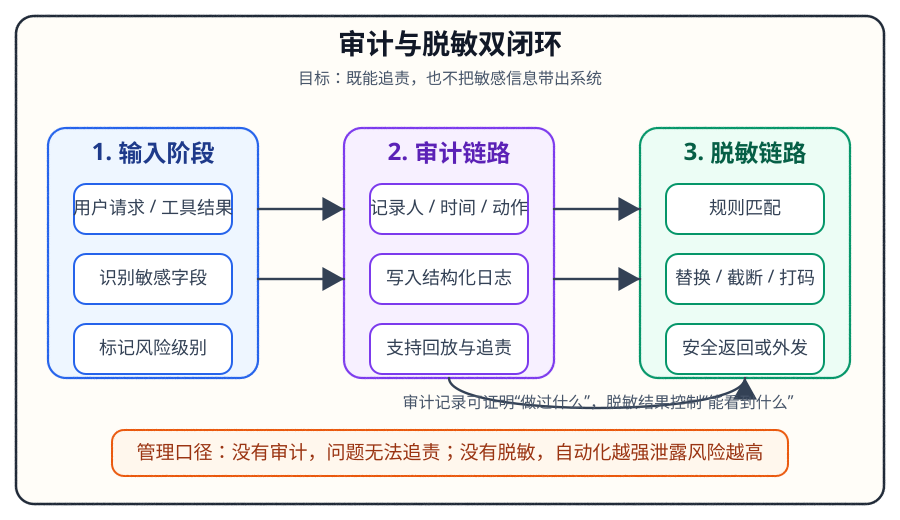

# Day 13｜审计与脱敏规范实践

## 今日主题

审计与脱敏是数据安全治理的两大基石。审计解决「谁在什么时候做了什么」的可追溯问题，脱敏解决「敏感数据不被泄露」的隐私保护问题。两者结合，既满足合规要求，又能在数据流转过程中保护敏感信息。

## 技术原理（技术视角）

### 审计日志核心机制

- **事件采集**：OpenClaw 对所有执行动作自动记录，包括调用者、调用时间、输入参数、执行结果、耗时等关键字段
- **存储架构**：采用结构化存储，支持时间范围查询、关键词检索、聚合分析
- **日志级别**：支持 DEBUG / INFO / WARN / ERROR 四级，企业可根据场景配置不同级别的日志详细程度
- **脱敏策略执行点**：在日志写入前统一进行脱敏处理，确保存储的已是安全数据

### 数据脱敏核心机制

- **敏感数据识别**：基于预定义规则（如正则、手机号、身份证号、银行卡号）或自定义关键词自动识别
- **脱敏规则库**：
  - 手机号：138****1234
  - 身份证号：320***********1234
  - 银行卡号：仅保留前四位和后四位
  - 邮箱：部分字符替换
- **静态脱敏 vs 动态脱敏**：
  - 静态脱敏：数据导出时批量处理，适用于报表、数据共享场景
  - 动态脱敏：实时查询时即时处理，适用于前台展示、API 返回场景

### 关键组件关系

```
用户操作 → 审计事件采集 → 脱敏规则匹配 → 脱敏处理 → 安全存储 → 合规查询
```

## 业务翻译（业务视角）

### 这项能力解决的核心问题

1. **合规刚性需求**：数据安全法、个人信息保护法要求企业必须具备数据审计和脱敏能力，否则面临行政处罚
2. **内部风险控制**：操作可追溯，出了问题能定责到人，减少「说不清」的模糊地带
3. **数据流转安全**：在客服查询、报表导出、数据共享等场景下，敏感信息不被泄露

### 对效率/质量/速度/可控的影响

- **效率**：自动脱敏替代人工处理，导出报表无需二次加工
- **质量**：规则统一，避免人工疏忽导致的泄露
- **速度**：实时脱敏不影响业务响应速度
- **可控**：审计日志完整保留，支持事后追溯和审计检查

## 典型场景（个人版）

1. **客服查询客户订单**：客服输入客户手机号，系统返回脱敏后的订单信息，客服可见姓名和部分手机号，但无法获取完整敏感数据

2. **运营导出用户名单**：运营点击「导出」，系统自动过滤身份证号、银行卡号等敏感字段，导出文件可直接分发

3. **审计人员检查操作日志**：审计员查询某时间段内的所有操作记录，可以看到每个操作的发起人、操作内容、执行结果，但敏感字段已被脱敏

4. **API 数据返回**：第三方系统调用 OpenClaw API 获取数据时，接口返回的所有敏感字段自动经过脱敏处理

## 官方资料（带看点）

### 本地文档

- [[官方文档-本地镜像(节选)/审计日志]] - 看点：审计日志的结构字段、存储方式、查询接口
- [[官方文档-本地镜像(节选)/数据脱敏]] - 看点：内置脱敏规则、自定义规则配置、动态/静态脱敏区别
- [[本地文档索引]] - 看点：所有本地可用的 OpenClaw 文档清单

### 在线文档

- https://docs.openclaw.ai/docs/concepts/audit-log - 审计日志官方文档
- https://docs.openclaw.ai/docs/concepts/data-masking - 数据脱敏官方文档
- https://docs.openclaw.ai/docs/concepts/security - 安全架构总览

## 图示



> 流程说明：原始数据输入后分为两条线——审计线进行事件采集、日志写入、安全存储；脱敏线进行规则匹配、数据处理、输出脱敏后数据。最终都支持合规查询。

## 管理者关注点（成本/效率/风险）

### 成本

- 存储成本：审计日志需要长期保留，默认建议保留 90 天，按日均日志量估算存储费用
- 计算成本：脱敏处理有一定 CPU 开销，但通常可忽略不计

### 效率

- 自动化收益：一次配置，长期自动执行，省去人工审核和脱敏环节
- 查询效率：审计日志支持索引查询，问题排查时间可缩短 50% 以上

### 风险

- 合规风险：未配置审计和脱敏可能导致合规检查不通过
- 泄露风险：脱敏规则配置不当可能导致敏感信息仍可还原
- 追溯风险：日志保留时间过短可能导致问题无法追溯

## 本日自检

1. 我是否能说清审计日志记录了哪些关键字段？
2. 我是否能列举至少 3 种常见敏感数据的脱敏规则？
3. 我是否知道在什么场景下应该用静态脱敏、什么场景下用动态脱敏？
4. 我是否能描述审计与脱敏两者的关系和执行顺序？

## 一句话总结

审计是「留下可追溯的痕迹」，脱敏是「让敏感数据安全流转」，两者结合才能实现数据安全与合规兼得。
