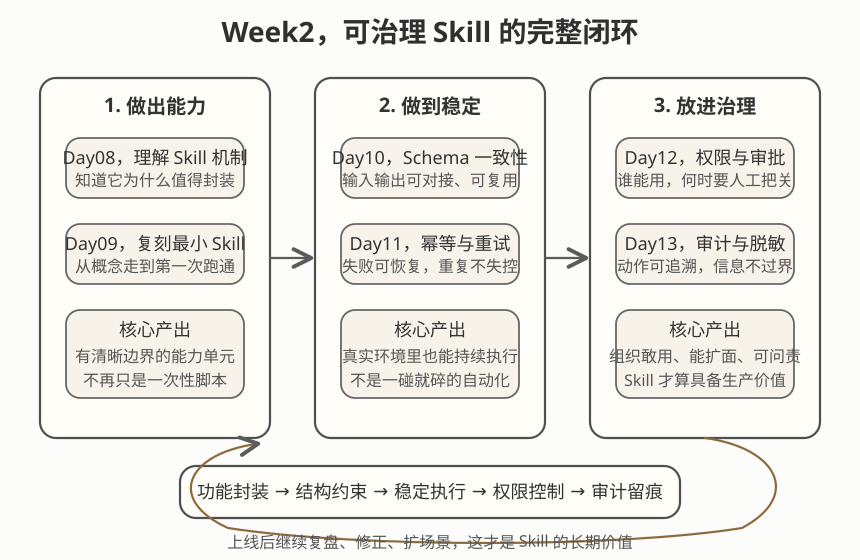

# Day 14｜Week2复盘：第一个可治理Skill

## 今日主题
把 Day08-13 学到的能力组装成**第一个可治理的 Skill**：
**从“会写 Skill”，到“能上线”、“可控制”、“可审计”的完整交付。**

---

## 技术原理（技术视角）

### 1) Week2 的核心机制（Skill 生命周期）
- **开发入口（Day08）**：Skill 是可复用工具的标准化封装，有明确的输入输出契约。
- **最小可用（Day09）**：从 0 到 1 写第一个 Skill，验证功能闭环。
- **Schema 设计（Day10）**：输入输出的结构化定义，确保 Skill 间可对接。
- **容错策略（Day11）**：幂等保证幂等性、超时设置合理、重试机制防瞬时故障。
- **权限体系（Day12）**：分级权限 + 审批流，防止 Skill 被滥用。
- **审计能力（Day13）**：日志脱敏 + 操作留痕，满足合规要求。

### 2) 组件关系（Skill 治理全链路）
```
开发 → 测试 → 权限审批 → 上线 → 执行 → 审计 → 迭代
```

### 3) Week2 常见误区
- **误区A：Skill 写完就上线**，跳过权限审批和审计设计，上线后风险不可控。
- **误区B：Schema 随意设计**，导致 Skill对接，后续扩展成本高。
- **误区C：忽视幂等性**，重 间无法试场景下产生重复操作或数据不一致。
- **误区D：日志不脱敏**，敏感信息泄露，合规风险。

---

## 业务翻译（业务视角）

### 这项能力解决什么问题
管理者最关心的是：
- Skill 能不能**安全上线**？
- 谁能**审批**、谁能**执行**？
- 出了问题能否**定责**？

Week2 的价值就是给 Skill 加上“治理外衣”，让 AI 能力从实验走向生产。

### 为什么业务能理解并愿意使用
- **可上线**：有审批流，符合企业安全要求。
- **可追溯**：审计日志 + 脱敏，出了问题能定位。
- **可复用**：Schema 标准化，多个场景可以共用同一个 Skill。

### 提效 / 提质 / 提速 / 可控价值
- **提效**：Skill 一次开发多处复用，减少重复造轮子。
- **提质**：Schema 约束 + 幂等设计，减少对接错误和数据异常。
- **提速**：审批流线上化，上线周期从周缩短到天。
- **可控**：权限分级 + 审计留痕，风险可识别可追溯。

---

## 典型场景（个人版）
1. **第一个可上线 Skill 交付**：从开发到审批到审计全链路跑通。
2. **多 Skill 组合任务**：通过标准 Schema 对接多个 Skill 实现复杂流程。
3. **合规审计迎检**：用审计日志 + 脱敏记录应对检查。

---

## 官方资料（带看点）

### 本地文档（知识库镜像路径，优先）
- [[03-Resources/效率工具/OpenClaw-30天学习手册/官方文档-本地镜像(节选)/concepts__skills.md]]  
  看点：Skill 的定义、开发入口和复用机制。  
- [[03-Resources/效率工具/OpenClaw-30天学习手册/官方文档-本地镜像(节选)/concepts__security.md]]  
  看点：权限分级、审批流设计思路。  
- [[03-Resources/效率工具/OpenClaw-30天学习手册/官方文档-本地镜像(节选)/concepts__observability.md]]  
  看点：日志、审计与可观测性设计。  
- [[03-Resources/效率工具/OpenClaw-30天学习手册/官方文档-本地镜像(节选)/guides__skill-dev.md]]  
  看点：Skill 开发实战步骤。  

### 在线文档
- https://docs.openclaw.ai/docs/concepts/skills
- https://docs.openclaw.ai/docs/concepts/security
- https://docs.openclaw.ai/docs/concepts/observability
- https://github.com/openclaw/openclaw/tree/main/docs

---

## 图示



图示阅读建议：先看左侧开发环节，再看中间治理环节（权限+审批+审计），最后看右侧上线后的监控与迭代。

---

## 管理者关注点（成本 / 效率 / 风险）
- **成本**：Skill 治理需要前期投入，但上线后复用率高，边际成本递减。
- **效率**：标准化 Schema + 审批流线上化，整体交付效率提升。
- **风险**：跳过治理环节直接上线，风险不可控；过度治理则影响迭代速度，需要平衡。

---

## 本日自检
1. 我能否用 3 分钟讲清"Skill 从开发到上线的全治理链路"？
2. 我是否能说清 Schema、幂等、权限、审计四个环节的作用和关系？
3. 我是否有一个自己场景下的 Skill 治理检查清单？

---

## 一句话总结
**Week2 的成果不是写了 6 个 Skill，而是掌握了让 Skill 从“能跑”到“能上线”、“可治理”的完整方法论。**
