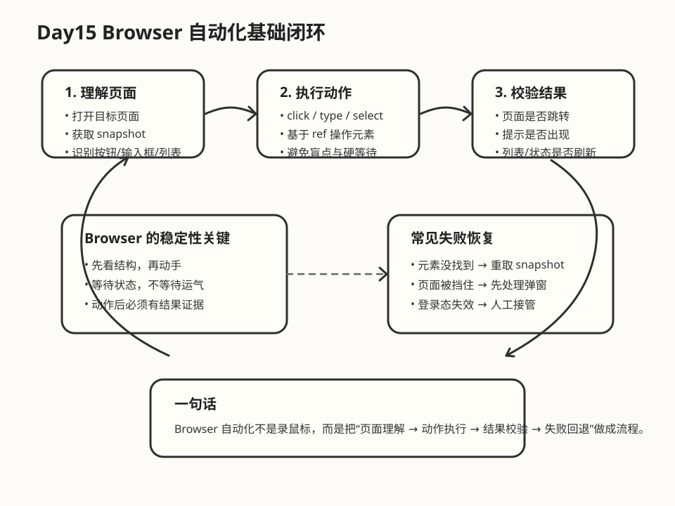

# Day 15｜Browser 自动化基础能力

## 今日主题
今天这篇不是讲“浏览器能不能自动点点点”，而是要建立一个更稳的认知：**OpenClaw 的 Browser 自动化，本质上不是录制鼠标轨迹，而是先理解页面结构，再执行动作，并在每一步做结果校验。**

如果把 Shell 工具理解为“操作本机系统”，那 Browser 工具就是“操作网页系统”。它适合处理登录后的后台页面、表单填写、网页检索、状态截图、结果校验等任务。真正决定它能不能在业务里落地的，不是能不能点到按钮，而是：**能否稳定识别页面、可靠执行、出错时知道怎么恢复。**

## 技术原理（技术视角）
### 1）Browser 自动化的核心链路
OpenClaw 的浏览器能力通常会围绕一条标准链路展开：

**打开页面 → 获取快照 → 定位元素 → 执行动作 → 再次校验页面状态**

这里最关键的一点是“快照（snapshot）”。很多人直觉上会把浏览器自动化理解成视觉点击，但在 OpenClaw 里，更可靠的方式是读取页面的可交互结构，比如按钮、输入框、下拉框、链接以及它们的可访问性标识，再基于这些结构做动作。

这意味着它不是“看见一个蓝色按钮就点过去”，而是更像“识别到一个名为‘提交’的按钮元素，然后执行点击”。这样的好处是：
- 对分辨率变化更不敏感
- 对页面轻微改版更有韧性
- 更容易做动作前后的状态比对

### 2）为什么 snapshot 比盲点更重要
网页会动态加载、懒渲染、弹窗遮挡、局部刷新。如果没有先做结构化快照，就容易出现三类问题：
- **点错位置**：页面布局稍微变化，坐标就偏了
- **点不到元素**：元素还没出现，或者被遮挡
- **点了不知道成没成功**：没有结果校验，只能靠猜

所以更稳的做法不是“多等 3 秒”，而是：
- 先读取当前页面状态
- 识别当前可交互元素
- 执行动作后再次读取页面
- 用成功提示、标题变化、列表数据变化等做校验

一句话：**snapshot 是决策依据，不是附属步骤。**

### 3）Browser 工具的几个关键动作
在日常自动化里，几个高频动作就够用了：
- **open / navigate**：打开目标页面
- **snapshot**：读取当前页面结构，拿到稳定引用
- **act.click / act.type / act.select / act.press**：执行点击、输入、选择、按键等动作
- **screenshot**：补充视觉证据，便于复盘和审计

其中 `snapshot + act` 是最核心的组合。前者负责“看懂页面”，后者负责“动手操作页面”。如果没有这套组合，自动化就容易退化成脆弱脚本。

### 4）稳定性的关键不在“快”，在“可恢复”
一个能上生产的自动化流程，不会假设“每一步都成功”。它要预留失败处理分支，比如：
- 元素没找到：重新取快照，再定位一次
- 页面有弹窗：先处理弹窗，再回主流程
- 登录态失效：中断并提示人工接管
- 提交后没结果：校验是否真的失败，避免重复提交

所以 Browser 自动化真正成熟的标志，不是能跑通 happy path，而是**遇到页面抖动、加载延迟、元素改名时，仍有回退策略。**

### 5）常见误区
**误区一：把浏览器自动化当成 UI 录像回放。**
录制一次能跑，不代表长期稳定。页面一改版就容易崩。

**误区二：大量使用固定等待。**
`wait 5 秒` 看起来简单，但它既浪费时间，也不可靠。慢网时不够，快网时又冗余。

**误区三：只做动作，不做校验。**
没有校验的自动化，表面上“执行了”，实际上可能什么都没完成。

## 业务翻译（业务视角）
### 这项能力解决什么问题
很多业务系统没有开放 API，或者 API 不完整，但员工每天都在网页后台重复做同样的动作：查数据、筛选、导出、录入、提交、截图、核对。Browser 自动化的价值，就是把这类“人能做、规则也清晰”的网页操作，逐步转成可重复执行的数字流程。

### 为什么业务能理解并愿意使用
因为它很接近现有工作方式。业务同学不需要先理解接口文档，只要知道“平时在网页上怎么做”，就能理解自动化在替代什么动作。

对业务来说，它的好处不是“用了先进技术”，而是三件具体的事：
- **减少重复点击**：把高频机械动作交给自动化
- **降低漏操作**：固定流程比人工更稳定
- **保留过程证据**：快照和截图让复盘更容易

### 提效 / 提质 / 提速 / 可控价值
- **提效**：把原来 10 分钟的后台操作压缩成 1~2 分钟
- **提质**：减少漏填、错选、忘记截图等低级失误
- **提速**：遇到批量任务时更明显，比如多页面巡检、多账号核对
- **可控**：通过快照、日志、截图留痕，方便审计和复盘

## 典型场景（个人版）
1. **运营后台巡检**
   每天早上自动打开几个固定页面，检查关键指标是否刷新、是否有异常提示，并生成截图留档。

2. **表单批量录入**
   对规则明确、字段固定的网页表单执行批量填报，减少人工重复输入。

3. **登录后信息抓取**
   某些数据只能在登录后台里查看，无法通过公开页面或开放接口获取，这时可以通过浏览器快照方式提取关键信息。

4. **回归验证辅助**
   新版本上线后，自动打开关键路径页面，验证能否正常进入、按钮是否可点击、提交后是否出现预期提示。

## 官方资料（带看点）
### 本地文档（知识库镜像路径）
- [[03-Resources/效率工具/OpenClaw-30天学习手册/本地文档索引]] - 看点：作为学习入口，后续可把 Browser 相关能力映射到统一索引里，便于按主题回查。
- [[03-Resources/效率工具/OpenClaw-30天学习手册/官方文档-本地镜像(节选)/README]] - 看点：如果本地镜像里已同步 Browser 章节，可优先从这里阅读，减少在线跳转成本。

### 在线文档
- https://docs.openclaw.ai/tool-browser - 看点：看 Browser 工具支持的动作类型、snapshot 用法、targetId / ref 的关系。
- https://docs.openclaw.ai - 看点：查工具设计、会话上下文、自动化执行模型。
- https://github.com/openclaw/openclaw - 看点：看真实项目结构与工具定义，理解 Browser 能力如何融入整个 Agent 执行框架。

> 如果本地镜像暂时还没有 Browser 专题，建议后续把在线文档节选同步进 `官方文档-本地镜像(节选)/`，形成“先本地阅读、再在线延伸”的学习路径。

## 图示

这张图重点表达 Browser 自动化不是“一把梭点击”，而是：**先理解页面，再操作，再验证，失败时可回退。**

## 管理者关注点（成本 / 效率 / 风险）
### 成本
- 初次搭建成本不高，但前提是先挑“高频、规则清晰、页面相对稳定”的流程
- 如果拿变化非常快、依赖强人工判断的页面做首批试点，ROI 会被拉低

### 效率
- 优先从“固定后台巡检、固定报表导出、固定表单录入”这三类场景切入，最容易形成正反馈
- 一旦沉淀成模板，后面复制到其他页面的边际成本会下降

### 风险
- 登录态、验证码、频繁改版、权限受限页面，都会影响自动化稳定性
- 涉及写操作的流程必须加结果校验，避免重复提交或误操作
- 对外部系统自动化要考虑合规边界，不要绕过平台权限设计

## 本日自检
1. 我能否用一句话解释 `snapshot + act` 为什么比盲点页面更可靠？
2. 我能否区分“固定等待”和“状态校验”在稳定性上的差异？
3. 如果一个网页按钮突然找不到，我是否知道应该先重取快照，再排查遮挡、改名或登录态失效？

## 一句话总结
**Browser 自动化的本质，不是代替鼠标，而是把“理解网页结构 → 执行动作 → 校验结果”做成可重复、可恢复、可审计的流程。**
