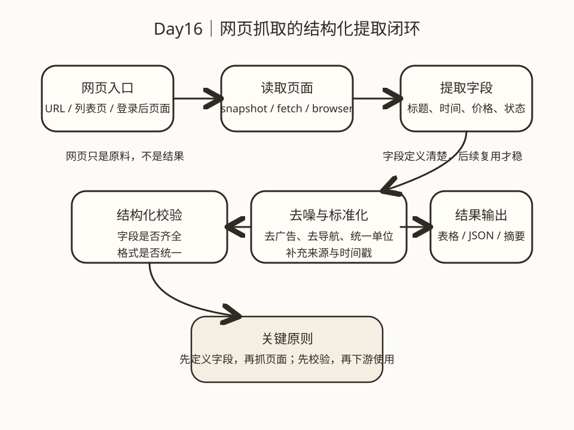

# Day 16｜网页抓取任务：结构化提取

## 今日主题
到了 Browser 自动化这一周，很多人会自然想到一个问题：**如果我不是要“点击网页完成操作”，而是要“从网页里稳定拿到信息”，OpenClaw 应该怎么做？**

这就是今天的主题：**网页抓取任务的核心，不是把整页内容搬回来，而是把网页里的有效信息提炼成结构化结果。**

所谓“结构化提取”，可以简单理解为：
- 先明确你要什么字段
- 再决定用什么方式读取网页
- 最后把结果整理成可比较、可筛选、可复用的标准格式

如果没有这一步，网页抓取就很容易停留在“看起来抓到了很多字”，但业务真正想要的价格、时间、状态、标题、链接、负责人这些关键信息，反而不够稳定。真正能进入业务流程的抓取能力，必须从“页面内容读取”升级到“字段级提取”。

## 技术原理（技术视角）
### 1）网页抓取不是“拿全文”，而是“拿字段”
很多人第一次做抓取，会下意识把目标设成：把整个网页内容保存下来。但业务真正需要的，往往不是整页文本，而是几个明确字段，例如：
- 新闻列表页中的标题、发布时间、来源、链接
- 商品页中的商品名、价格、库存状态、规格
- 后台页面中的订单编号、处理状态、更新时间
- 招聘页中的岗位名、地点、薪资区间、投递链接

所以结构化提取的第一原则是：**先定义目标字段，再选择抓取方式。**

如果字段定义不清，后续就会出现三个常见问题：
- 抓回来的信息太多，但无法用于筛选和统计
- 同一类页面提取格式不一致，难以聚合
- 每次需求稍微变化，都要重新返工

### 2）OpenClaw 里常见的网页读取方式
在 OpenClaw 里，网页信息提取通常会用到三类能力：

#### 方式一：`web_fetch`
适合公开页面、无需复杂交互、重点是正文或可读内容提取的场景。

它的优势是轻量、快、成本低，适合：
- 文章摘要
- 文档页抓取
- 公告页读取
- 博客正文提取

但它不适合处理强交互页面，也不保证拿到完整动态内容。

#### 方式二：`browser snapshot`
适合你需要读取页面结构、识别按钮/输入框/列表项，或者页面依赖前端渲染的场景。

它的优势是：
- 能读取可交互结构
- 对动态页面更友好
- 便于和后续动作串联

如果页面内容是加载后才出现，或者列表、卡片、表格需要按页面结构识别，`snapshot` 往往比只抓静态文本更稳。

#### 方式三：`browser + act`
适合登录后页面、需要点开详情、翻页、切换筛选条件、展开折叠区块后再提取数据的场景。

也就是说，很多抓取任务并不是“读取一次就结束”，而是：
**进入页面 → 切换筛选条件 → 展开详情 → 提取字段 → 进入下一页继续提取**。

这种时候，抓取本质上就是“半自动浏览 + 结构化提取”的组合。

### 3）结构化提取的标准闭环
一个可复用的抓取流程，通常包含以下几个步骤：

#### 第一步：定义字段模型
先写清楚你到底要哪些字段，例如：
- `title`
- `publish_time`
- `source`
- `url`
- `status`
- `price`

字段模型一定要尽量稳定，因为它决定了你后续输出能不能进入表格、知识库、通知、周报或自动化流程。

#### 第二步：定位信息来源
不是所有信息都在同一层里。有些字段在列表页就能看到，有些必须进入详情页才能拿到；有些在正文里，有些在按钮旁边的小标签里。

所以要先区分：
- 列表级字段
- 详情级字段
- 元信息字段（来源、抓取时间、页面链接）

#### 第三步：提取后做标准化
即便同一类网页，数据也常常不整齐，比如：
- 时间格式不统一（2026-03-14 / 03-14 / 今天 09:00）
- 价格带货币符号或单位
- 状态字段有同义表达（已完成 / 完成 / Closed）
- 文本里夹杂广告、按钮文案、导航项

所以抓取之后，必须做一层“标准化整理”：
- 统一字段名
- 统一时间格式
- 统一枚举值
- 去掉无关噪音
- 补充抓取时间戳和来源链接

#### 第四步：结果校验
这是最容易被忽略、但对业务最关键的一步。

没有校验的抓取，很容易变成“看起来抓到了，但其实不能用”。常见校验包括：
- 关键字段是否为空
- 字段数量是否符合预期
- 列表条数是否异常减少
- 关键值格式是否正确
- 是否抓到了导航栏/广告等错误内容

一句话：**抓取成功不等于业务可用，结构化校验才是交付标准。**

### 4）为什么结构化提取比全文抓取更有业务价值
全文抓取适合做“备份”和“全文检索”，但对大多数业务动作来说，不够直接。

业务系统更常见的需求是：
- 把新增信息放进日报
- 对价格做监控
- 对状态做预警
- 对标题做聚类
- 对链接做后续跳转
- 对多个来源做横向比较

这些动作都要求结果是结构化的。否则你每次都要重新从长文本里再解析一遍，既慢又不稳定。

所以从系统设计角度看：
**网页是非结构化输入，结构化字段才是业务真正的中间产物。**

### 5）常见失败点
#### 失败点一：页面能打开，但字段定位不稳定
可能原因：
- 页面结构更新
- 页面局部异步刷新
- 列表项命名变化
- 元素被弹层遮挡

解决思路：优先按语义结构定位，必要时重取快照，而不是盲目重复点击。

#### 失败点二：抓到了内容，但格式不统一
典型表现是同一字段无法直接汇总，例如一个时间字段里既有绝对日期也有相对时间。

解决思路：把“标准化”单独当成一个明确步骤，而不是混在抓取里随缘处理。

#### 失败点三：抓了很多，但没有业务可用字段
这通常是因为任务定义阶段就没把目标说清楚。

解决思路：先写字段清单，再抓网页，而不是先抓一堆内容回来再想怎么用。

## 业务翻译（业务视角）
### 这项能力解决什么问题
现实里很多信息都困在网页里：官网公告、文档更新、竞争对手价格、后台列表、公开数据、招聘信息、活动页内容……人可以看懂，但系统不能直接消费。

结构化提取的价值，就是把这些“只能人读”的页面，转成“系统也能继续处理”的标准数据。

这意味着它不只是一个“抓网页”动作，而是后续多个业务动作的入口，比如：
- 自动汇总
- 变化监控
- 定时通知
- 数据入库
- 复盘追踪
- 周报/月报生成

### 为什么业务能理解并愿意使用
因为它对应的是非常直白的业务痛点：
- 每天都要看同一批网页
- 每次都要手工复制关键字段
- 不同人看同样页面，提取口径不一致
- 一旦量上来，人工跟踪就会漏

当业务看到的不是“自动抓网页”这件事，而是“每天自动把我要的几个字段整理好”，接受度会高很多。

### 提效 / 提质 / 提速 / 可控价值
- **提效**：减少人工查找、复制、整理的重复动作
- **提质**：统一字段口径，降低不同人理解偏差
- **提速**：信息更新后更快进入业务动作，而不是等人工空下来再处理
- **可控**：通过字段校验、来源链接、抓取时间戳，让结果可追溯、可复查

## 典型场景（个人版）
1. **资讯监控与摘要沉淀**
   每天抓取几个固定来源的更新页面，提取标题、发布时间、链接和一句话摘要，自动汇总成晨报或知识库输入。

2. **竞品价格与活动监测**
   从公开页面提取商品名、价格、促销文案、活动时间，形成结构化对比表，而不是人工截图保存。

3. **登录后后台数据巡检**
   对需要登录才能查看的运营后台，用 Browser 打开页面、读取表格字段、提取关键状态并输出巡检结果。

4. **文档更新跟踪**
   从官方文档页提取章节标题、更新时间、链接，识别哪些内容新增或变更，用于技术学习和内部同步。

## 官方资料（带看点）
### 本地文档（知识库镜像路径）
- [[03-Resources/效率工具/OpenClaw-30天学习手册/本地文档索引]] - 看点：先从本地索引快速定位 Browser、Web、Session 等相关资料，降低查找成本。
- [[03-Resources/效率工具/OpenClaw-30天学习手册/官方文档-本地镜像(节选)/tools__web.md|tools__web.md]] - 看点：理解 `web_search` / `web_fetch` 适合处理什么类型的网页数据，什么时候该优先用轻量抓取。
- [[03-Resources/效率工具/OpenClaw-30天学习手册/官方文档-本地镜像(节选)/tools__browser.md|tools__browser.md]] - 看点：理解 `snapshot`、`act`、目标元素定位方式，适合动态页面与登录后页面提取。
- [[03-Resources/效率工具/OpenClaw-30天学习手册/官方文档-本地镜像(节选)/concepts__context.md|concepts__context.md]] - 看点：理解上下文在提取任务里的作用，尤其是如何把网页内容变成后续决策输入。

### 在线文档
- https://docs.openclaw.ai/tools/web - 看点：看 Web 工具的适用边界，理解何时用轻量网页提取而非完整浏览器控制。
- https://docs.openclaw.ai/tool-browser - 看点：看 Browser 快照、动作与页面结构化读取方式，适合理解动态网页提取。
- https://docs.openclaw.ai/concepts/context - 看点：理解抓取结果如何进入后续分析、总结与自动化链路。
- https://github.com/openclaw/openclaw - 看点：看工具定义与项目结构，理解网页抓取能力如何接入整个 Agent 工作流。

## 图示

这张图想表达的是：**网页抓取不是“把页面搬回来”，而是“把网页当原料，提炼成稳定字段，再进入业务动作”。**

## 管理者关注点（成本 / 效率 / 风险）
### 成本
- 真正的成本不在“能不能抓”，而在“字段定义是否稳定、页面是否易变、后续是否有人维护”
- 首批场景要优先选择页面结构相对稳定、字段价值明确的对象，否则维护成本会过快上升

### 效率
- 结构化提取一旦形成统一字段模型，后续接日报、看板、提醒、知识库都很顺
- 相比人工复制网页内容，字段化结果更容易复用，也更容易做自动化串联

### 风险
- 网页结构调整可能导致字段错位或缺失
- 若涉及登录后页面，要注意权限、审计与数据边界
- 若没有做字段校验，下游决策会建立在错误数据上，风险比“没抓到”更高

## 本日自检
1. 我能否区分“抓网页全文”和“做结构化字段提取”在业务价值上的差别？
2. 我是否能判断公开静态页面更适合 `web_fetch`，而动态或登录后页面更适合 `browser snapshot` / `browser + act`？
3. 当抓取结果进入日报、提醒或看板前，我是否知道至少要做字段完整性和格式统一校验？

## 一句话总结
**网页抓取真正有业务价值的，不是抓到了页面，而是把页面里的关键信息稳定提炼成可校验、可复用、可流转的结构化字段。**
