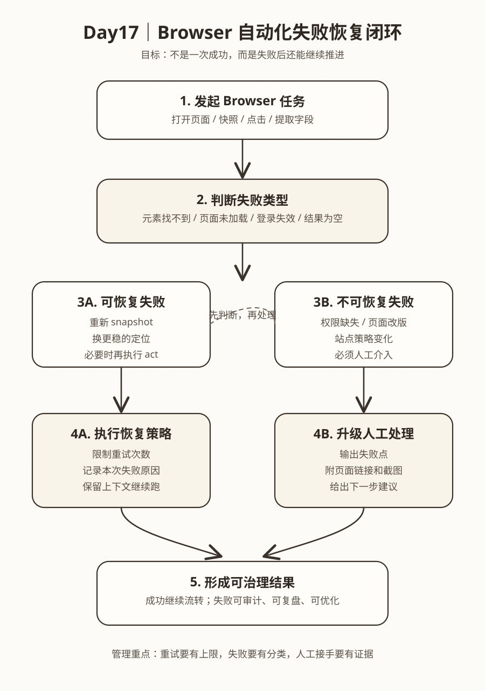

# Day 17｜失败恢复：提升自动化鲁棒性

## 今日主题
到了 Browser 自动化这一段，很多人会有一个误区：觉得只要把点击路径写出来，流程就应该一直稳定跑下去。

但真实世界不是这样。网页会慢、按钮会变、登录会失效、弹窗会打断、列表会为空、网络会抖动。**自动化真正的分水岭，不是“能不能跑通一次”，而是“失败之后能不能恢复，恢复不了时能不能把问题说清楚”。**

所以今天的主题不是再讲一次 Browser 怎么点，而是讲：**为什么失败恢复机制，决定了自动化任务能不能从演示版走向生产可用。**

如果没有失败恢复，你会得到一个表面上很聪明、实际上非常脆弱的流程：
- 演示时成功一次，大家觉得很惊艳
- 真正放进日常任务后，经常卡住
- 一旦失败，没有明确原因，也没有补救路径
- 最后团队会得出错误结论：不是流程设计有问题，而是“自动化不靠谱”

本质上，失败恢复不是额外加分项，而是 Browser 自动化进入业务使用前的基础设施。

## 技术原理（技术视角）
### 1）为什么 Browser 自动化天然会遇到失败
Browser 自动化和调用一个稳定 API 不同，它面对的是“变化中的界面”。

页面层的变化非常多：
- 页面加载速度不稳定
- 前端渲染先后顺序变化
- 元素名称、位置、结构被改版
- 登录态失效导致跳回登录页
- 弹窗、遮罩、公告条临时插入
- 列表为空、分页异常、筛选结果变少

所以失败不是异常事件，而是常态的一部分。系统设计上必须默认：**任务会失败，只是失败原因不同。**

这也是为什么做自动化时，不能只写“成功路径”，还要写“失败时怎么判断、怎么处理、什么时候停止”。

### 2）失败恢复的核心，不是盲目重试，而是先分类
很多流程一失败，最常见的第一反应是：重试三次。

这在少数情况下有效，但如果不做分类，重试经常只是重复浪费时间。更稳的做法是先把失败分成两类：

#### 可恢复失败
指的是通过重新获取页面状态、重新定位元素、补充等待或调整动作，有机会继续推进的失败。例如：
- 页面还没完全加载出来
- `snapshot` 读取到的结构已经过期
- 元素定位太脆弱，换一个更稳定的语义定位就能恢复
- 某一步点击后页面局部刷新，需要重新读取结构

这类失败的处理重点是：
- 重新拿当前状态
- 根据当前状态做下一步判断
- 不依赖旧引用硬点到底

#### 不可恢复失败
指的是靠自动重试基本解决不了，必须人工介入或改流程设计的失败。例如：
- 账号权限被回收
- 页面整体改版，原有定位全部失效
- 站点加了新的校验或限制
- 业务规则发生变化，原流程本身已经不成立

这类失败如果继续重试，不会提升成功率，只会制造噪音。更好的做法是：**尽快停止、保留证据、把问题升级给人。**

### 3）恢复闭环通常包含哪几个步骤
一个更像“生产系统”而不是“演示脚本”的 Browser 任务，通常要有下面这个闭环：

#### 第一步：识别失败发生在哪一层
要先分清问题到底是：
- 打不开页面
- 打开了但没加载完
- 页面正常但元素找不到
- 元素能找到但点击后没有效果
- 提取结果为空或不完整
- 任务动作成功了，但业务结果不符合预期

这个区分很重要，因为不同层的问题，对应完全不同的修复动作。

#### 第二步：重新获取环境状态
不要拿旧快照一直重复操作。Browser 流程里最常见的问题之一，就是页面已经变化了，流程却还在依赖旧的元素引用。

更稳的方式是：
- 必要时重新 `snapshot`
- 基于当前页面结构重新判断下一步
- 尽量使用更稳的语义定位，而不是依赖一次性结构

可以理解为：**恢复不是回放上一步，而是先确认当前世界长什么样，再决定怎么继续。**

#### 第三步：限制恢复次数
恢复机制如果没有上限，就很容易演变成“无限循环点击”。

所以通常要设置明确边界：
- 同类错误最多重试几次
- 某一步恢复超过阈值就终止
- 同一页面加载异常持续多久就退出

这一步的意义不是“保守”，而是为了避免：
- 消耗过多时间和资源
- 对目标站点造成异常压力
- 把真正需要人工处理的问题一直拖着不暴露

#### 第四步：记录失败原因和上下文
失败恢复做得好的系统，不只是会“再试一次”，还会把失败沉淀成可复盘的信息。例如：
- 哪一步失败
- 当时页面处于什么状态
- 失败类型是什么
- 是否已经尝试过恢复
- 最终是自动恢复成功，还是转人工处理

这决定了后续能不能系统性优化，而不是每次都靠感觉修脚本。

#### 第五步：给下游一个可消费的结果
自动化失败并不意味着流程就没有交付物。

一个成熟的任务，在失败时也应该输出结构化结果，例如：
- 成功 / 失败状态
- 失败原因分类
- 页面链接
- 截图或快照依据
- 建议下一步动作

这会让“失败”从一个黑盒异常，变成一个可被运营、研发、管理者共同理解的业务事件。

### 4）Browser 恢复动作常见设计方式
#### 方式一：重新 snapshot，再决定下一步
适合页面结构可能变化、局部刷新较多的场景。

优点是稳，缺点是稍慢。但相较于盲点，通常更值。

#### 方式二：更换更稳的定位策略
如果元素基于顺序位置或短暂文案定位，很容易脆。优先改成：
- 语义更清晰的按钮名
- 更稳定的表单字段标识
- 更明确的区域范围

恢复的本质，很多时候不是“再试一次”，而是“换一个不那么脆弱的抓手”。

#### 方式三：对特定异常做专门分支
比如：
- 检测到登录页就走重新登录分支
- 检测到空列表时输出“今日无数据”而不是报错
- 检测到弹窗时先关闭再继续

这类设计的价值在于：把“异常情况”转成“被预期到的业务分支”。

### 5）常见误区
#### 误区一：把重试当恢复
重试只是动作，恢复是判断 + 动作 + 边界。没有判断的重试，经常只是重复失败。

#### 误区二：只追求成功率，不记录失败模式
如果只看有没有跑通，很难知道系统脆弱在哪。长期来看，**失败数据本身就是优化路线图。**

#### 误区三：失败后直接中断，但不给人可读信息
对业务和管理者来说，“任务失败”这四个字没有价值；有价值的是：失败在哪、影响什么、下一步怎么办。

## 业务翻译（业务视角）
### 这项能力解决什么问题
Browser 自动化最容易卡在“可以演示，但不能接业务日常”。

根本原因不是成功路径做不出来，而是失败后没人兜底。只要任务稍微复杂一点，失败恢复就直接决定：
- 能不能稳定日跑 / 周跑
- 出问题时能不能快速定位
- 团队会不会因为偶发失败就放弃自动化

### 为什么业务能理解并愿意使用
业务不要求自动化百分之百不失败，业务真正要的是：
- 失败时别黑盒
- 出问题时别拖很久才发现
- 能恢复的尽量自动恢复
- 恢复不了时给清楚结论和处理建议

换句话说，业务要的是“可控”，不是“神奇”。

### 提效 / 提质 / 提速 / 可控价值
- **提效**：减少人工盯任务、重复重跑、反复查原因的时间
- **提质**：通过失败分类，降低“同一种问题每次都重新排查”的浪费
- **提速**：可恢复问题自动闭环，不必每次都等人介入
- **可控**：当任务失败时，能够清楚说明影响范围、原因和下一步动作

## 典型场景（个人版）
1. **日报抓取任务偶发失败**
   某个后台页面早晨加载变慢，自动化先重新 snapshot，再继续提取数据，而不是直接整条任务失败。

2. **运营后台登录态失效**
   流程识别到页面跳回登录页，不再盲点页面，而是输出“登录失效，需要人工确认”并附上页面线索。

3. **页面改版导致元素失效**
   某个按钮文案改了，流程连续两次恢复失败后停止运行，并把失败步骤和页面信息提供给维护者。

4. **列表为空但其实是正常业务状态**
   自动化识别“今日无新增数据”属于业务分支，而不是技术异常，于是输出空结果说明并继续后续流程。

## 官方资料（带看点）
### 本地文档（知识库镜像路径）
- [[03-Resources/效率工具/OpenClaw-30天学习手册/本地文档索引]] - 看点：先从本地索引快速定位 Browser、Web、Session 等相关资料，方便把恢复策略和工具能力对上。
- [[03-Resources/效率工具/OpenClaw-30天学习手册/官方文档-本地镜像(节选)/tools__browser.md|tools__browser.md]] - 看点：重点看 `snapshot`、`act`、定位方式和等待策略，理解恢复为什么要先重取状态。
- [[03-Resources/效率工具/OpenClaw-30天学习手册/官方文档-本地镜像(节选)/concepts__context.md|concepts__context.md]] - 看点：理解上下文如何承接失败信息，让自动化不是只有“报错”，而是能带着原因继续决策。
- [[03-Resources/效率工具/OpenClaw-30天学习手册/官方文档-本地镜像(节选)/tools__sessions.md|tools__sessions.md]] - 看点：理解复杂任务如何交给独立会话处理，失败时如何隔离上下文与状态。

### 在线文档
- https://docs.openclaw.ai/tool-browser - 看点：重点理解 Browser 的页面快照、交互动作与等待机制，恢复策略通常围绕这些能力展开。
- https://docs.openclaw.ai/concepts/context - 看点：看失败信息如何进入上下文，支撑下一步判断而不是简单报错。
- https://docs.openclaw.ai/tools/sessions - 看点：看复杂任务如何通过独立会话隔离运行，降低主流程被异常打断的概率。
- https://github.com/openclaw/openclaw - 看点：结合项目结构理解 Browser 能力、任务编排与失败处理思路是如何组合起来的。

## 图示

这张图想表达的是：**Browser 自动化不是“失败后一直重试”，而是先判断失败类型，再决定恢复、停止还是升级人工处理，最终把失败也变成可治理结果。**

## 管理者关注点（成本 / 效率 / 风险）
### 成本
- 恢复机制会增加一部分设计和测试成本，但这部分成本换来的是后续运维成本下降
- 如果不做失败分类，维护者会长期被动救火，隐性成本更高

### 效率
- 对高频任务来说，恢复机制比“纯成功路径优化”更能提升整体稳定交付率
- 一旦沉淀出标准失败分类，后续同类流程会更快复用

### 风险
- 无上限重试可能造成资源浪费，甚至触发目标站点限制
- 如果失败后没有证据链，人工接手会变慢，影响业务判断
- 如果把业务空结果误判成技术失败，会造成不必要告警与误操作

## 本日自检
1. 我是否能区分“可恢复失败”和“不可恢复失败”，而不是把所有异常都一股脑重试？
2. 当 Browser 流程失败时，我是否知道应该先重新获取页面状态，而不是抱着旧快照反复操作？
3. 我是否意识到，一个成熟的自动化流程即使失败，也应该输出清晰原因、证据和下一步建议？

## 一句话总结
**自动化的成熟度，不体现在永不失败，而体现在失败后能分类、能恢复、能止损、能把问题说清楚。**
