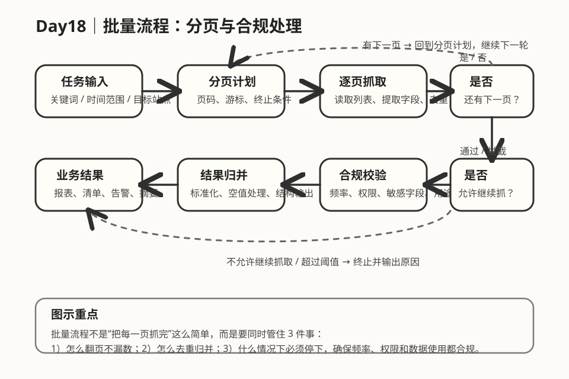

# Day 18｜批量流程：分页与合规处理

## 今日主题
当任务从“抓一页数据”升级到“持续抓很多页、很多批次、很多对象”时，真正的难点就不再是会不会调用工具，而是：**如何既抓得全，又抓得稳，还不能越界。**

批量流程最容易被低估。很多人第一次做自动化时，会把分页理解成一个简单循环：
- 读第一页
- 点击下一页
- 再读一页
- 一直重复到结束

看上去很直观，但一旦进入真实业务环境，这种理解很快就会出问题：
- 列表在翻页过程中会动态变化
- 分页方式不一定是页码，也可能是游标、滚动加载或时间窗口
- 不同页面的字段不完整，合并时容易重复或遗漏
- 请求频率太快、范围太大，容易触发限制
- 有些数据“技术上能拿到”，但“业务上未必应该拿”

所以今天这篇不是教你“怎么翻页”，而是要建立一个更成熟的认知：

**批量流程 = 分页机制 + 去重归并 + 节奏控制 + 合规边界。**

只要这四件事少一件，流程都可能在放大规模后失控。前期跑几页可能没问题，但一旦放到每天、每周、跨多个来源运行，问题就会集中爆发。

## 技术原理（技术视角）
### 1）分页的本质：不是翻页动作，而是遍历策略
从技术上看，分页并不等于“点下一页按钮”。分页的本质是：**用可控顺序遍历一组可能很大的数据集合。**

常见分页方式至少有 4 类：

#### 页码分页（Page Number）
最容易理解，典型形式是 1、2、3、4 这样的页签。

优点：
- 结构直观
- 适合人工理解与问题复盘
- 比较容易设置“最多抓多少页”这样的阈值

风险点：
- 页面总数可能动态变化
- 中间插入新数据后，前后页内容可能发生偏移
- 如果靠“固定页码 + 固定位置”提取，容易漏数或重复

#### 游标分页（Cursor）
不是基于页码，而是基于“上一次读到哪里”。比如接口返回 `next_cursor`、`offset token`、`last_id`。

优点：
- 更适合大规模数据遍历
- 通常比页码更稳定

风险点：
- 如果游标管理错了，恢复会很困难
- 一旦丢失 cursor，任务可能要从头开始
- 对业务同学不够直观，排查门槛更高

#### 无限滚动 / 懒加载分页
页面不显示明确页码，而是在滚动时不断加载新内容。

优点：
- 对用户体验友好
- 常见于内容流、商品流、消息流

风险点：
- 很难判断“已经到底”还是“只是还没加载完”
- 容易在自动化里出现重复读、漏读、等待过长
- 需要更强的状态判断与节奏控制

#### 时间窗口分页
按日期、时间段、更新时间分批抓，比如“先抓今天，再抓昨天，再抓更早”。

优点：
- 非常适合业务报表和增量同步
- 更容易解释“为什么抓这些，不抓那些”

风险点：
- 边界时间点容易重复或遗漏
- 时区、格式、精度不一致时会出错
- 如果窗口过大，可能一次抓太多；过小，又会产生大量任务切片

所以理解分页，第一步不是问“怎么点”，而是问：**当前任务用什么遍历策略最稳、最省、最容易解释。**

### 2）批量流程最怕的不是失败，而是“看起来成功但结果不对”
单步自动化失败通常容易发现，因为它会直接报错。

但批量流程有一类更危险的问题：流程跑完了，系统显示成功，结果却不完整、不一致，甚至方向错误。比如：
- 第 3 页抓取超时，结果被默默跳过
- 页面改版导致某字段为空，但流程仍继续执行
- 同一条数据在第 2 页和第 3 页都出现，最终重复统计
- 数据在抓取过程中更新，导致前后页边界错位

这类问题很难被第一时间发现，因为“技术层面任务结束了”，但“业务层面交付已经失真”。

因此批量流程的设计重点通常不只是：
- 能不能翻完

而是：
- 有没有终止条件
- 有没有去重机制
- 有没有页级校验
- 有没有结果归并规则
- 有没有异常页的补偿策略

换句话说，**批量流程比单次动作更需要“数据正确性思维”。**

### 3）分页流程通常要同时设计 4 个约束
#### 约束一：终止条件
流程必须知道什么时候停。

典型终止条件包括：
- 已没有下一页
- 结果为空且连续出现到阈值
- 已达到最大页数/最大记录数
- 已到设定的时间窗口下界
- 遇到权限限制或频率限制

没有终止条件的批量流程，最容易出现两种坏结果：
1. 无限循环，持续消耗资源
2. 明明数据抓完了，却还在重复抓旧内容

#### 约束二：去重逻辑
翻页只是读取动作，真正要交付给业务时，必须把结果归并成“可用数据集”。

常见去重依据：
- 主键 ID
- 链接 URL
- 业务单号
- `时间 + 标题 + 来源` 的组合键

如果没有去重，流程规模一大，数据污染会越来越严重。更麻烦的是，这种问题通常不是“今天全错”，而是“每天多错一点”，最后在报表层面形成系统性偏差。

#### 约束三：节奏控制
批量流程通常会对目标系统施加更高压力，因此要控制节奏。

常见控制项：
- 每页之间加等待
- 每批之间限速
- 碰到 429 / 频控提示时延迟重试
- 高峰期只抓增量，低峰期再做补全

节奏控制不是“为了礼貌”，而是为了降低三个风险：
- 被目标站点封禁或限流
- 因为过快操作导致页面状态不稳定
- 自己系统侧资源被长时间占满

#### 约束四：合规边界
这一步最容易在项目早期被忽视。

很多技术任务会默认“只要能抓就能用”，但实际不是这样。合规边界通常至少涉及：
- 是否有权限读取这类页面 / 数据
- 是否超出了原始业务用途
- 是否包含敏感字段（个人信息、联系方式、账号标识等）
- 是否超出合理频率，影响对方服务
- 是否需要做脱敏、汇总、最小化存储

所以批量流程不能只设计“抓取链路”，还要设计“放行条件”。

成熟的系统不是默认一把抓到底，而是：
- 先判断是否允许继续
- 对不该抓、不该存、不该下发的内容及时拦截

### 4）合规处理，技术上通常体现在哪些地方
合规不是一句“注意隐私”就算完成。它在技术实现上通常表现为以下几个动作：

#### 抓取前：做范围约束
例如：
- 只抓允许的时间范围
- 只抓明确授权的账户 / 页面
- 只抓任务目标真正需要的字段

这一步的核心是：**先缩小范围，再开始跑。**

#### 抓取中：做节奏和异常控制
例如：
- 避免高并发、避免短时间内翻太多页
- 识别“权限不足”“访问过快”等提示，立即停止或降速
- 对需要登录、审批的页面，不擅自绕过

这一步的核心是：**宁可少抓一点，也不要通过不稳定或越界方式去硬拿。**

#### 抓取后：做脱敏和最小输出
例如：
- 结果里只保留业务真正需要的字段
- 对联系人、手机号、邮箱等做脱敏
- 输出聚合结果，而不是原始明细
- 只保留必要留痕，不做长期原始数据堆积

这一步的核心是：**把技术拿到的数据，收缩成业务真正应当消费的结果。**

### 5）OpenClaw 视角下，批量流程为什么更需要“分层”
在 OpenClaw 这种工具编排环境里，批量流程往往不是一个动作，而是一串动作组合：
- 读取任务参数
- 打开页面或调用数据源
- 分页遍历
- 页内提取
- 结果归并
- 结构化输出
- 异常说明 / 留痕

如果这些动作全部写成一坨，就会出现两个问题：
1. 一旦某一页失败，整个任务难以恢复
2. 很难知道问题出在“分页”“提取”“归并”还是“合规判断”

更稳的设计方式是分层：
- **遍历层**：负责怎么一页页走
- **提取层**：负责每页拿什么字段
- **校验层**：负责判断字段是否完整、页面是否异常
- **归并层**：负责去重、汇总、标准化
- **治理层**：负责频率、权限、脱敏、输出边界

这样做的价值在于：即便将来换数据源、换页面、换业务目标，也不需要把整个批量流程推倒重来。

### 6）常见误区
#### 误区一：分页 = while 循环点“下一页”
这是最常见也最危险的简化。翻页动作只是表层，真正关键的是遍历策略、终止条件和结果校验。

#### 误区二：能拿多少就拿多少
批量能力一旦放大，没有边界就很容易越界。尤其在涉及账号后台、用户数据、业务系统时，技术上能跑通不代表组织上应该跑。

#### 误区三：抓取成功就等于业务成功
批量流程最终交付的是业务结果，而不是“技术动作执行完毕”。如果没有去重、校验、归并，成功只是表面成功。

#### 误区四：合规只在上线前补一版说明
合规不是文档动作，而是流程设计动作。没有体现在节奏控制、字段选择、输出收缩上，说明还没有真正落地。

## 业务翻译（业务视角）
### 这项能力解决什么问题
很多自动化项目一开始都能做出一个“演示版批量抓取”，但真正放到业务日常时，痛点马上出现：
- 今天抓到了，明天少了几页
- 数据看上去很多，但有重复
- 一跑快了就被限流
- 一不小心抓了不该沉淀的字段

所以这项能力解决的，不是“批量能不能跑”，而是：**批量任务能不能长期稳定、结果可信、边界清楚。**

### 为什么业务能理解并愿意使用
业务并不关心你背后是页码分页还是游标分页，业务真正关心的是三件事：
- 数据是不是够全、够准
- 过程会不会把系统搞崩或触发风险
- 出了问题能不能快速解释清楚

只要分页逻辑稳、结果口径一致、合规边界明确，业务就愿意把这类流程纳入日常使用。

### 提效 / 提质 / 提速 / 可控价值
- **提效**：减少人工逐页翻看、复制、汇总的重复动作
- **提质**：通过去重、字段校验、终止条件控制，降低结果失真概率
- **提速**：让日报、周报、巡检类任务能按固定节奏批量完成
- **可控**：把抓取范围、节奏、权限和输出格式都收进规则里，避免“今天能跑、明天翻车”

## 典型场景（个人版）
1. **多页后台列表的日报汇总**
   需要从多个分页列表中拉取昨日新增记录，并按统一结构输出成日报。这里最关键的是时间窗口、去重和页级完整性校验。

2. **内容/商品列表的批量巡检**
   面对无限滚动页面，需要判断何时到底、哪些字段必须提取、哪些异常只是“空结果”而不是流程错误。

3. **按时间窗口做增量同步**
   每天只同步最近 24 小时的数据，避免每次全量扫描。这里的重点不是“抓更多”，而是“抓刚好需要的那部分”。

4. **合规要求较高的数据整理任务**
   明细页里可能含有联系方式或身份标识，流程只允许输出脱敏后的统计摘要，不直接保留原始字段。

## 官方资料（带看点）
### 本地文档（知识库镜像路径）
- [[03-Resources/效率工具/OpenClaw-30天学习手册/本地文档索引]] - 看点：先从索引反查 Browser、Web、Exec、Sessions 等能力，建立“批量流程不是单工具”的整体视角。
- [[03-Resources/效率工具/OpenClaw-30天学习手册/官方文档-本地镜像(节选)/tools__browser.md|tools__browser.md]] - 看点：重点看页面读取、交互动作和等待机制，理解列表翻页、滚动加载、状态判断如何落地。
- [[03-Resources/效率工具/OpenClaw-30天学习手册/官方文档-本地镜像(节选)/tools__web.md|tools__web.md]] - 看点：理解什么时候应该用轻量抓取，什么时候必须上 Browser，避免为简单任务引入过重链路。
- [[03-Resources/效率工具/OpenClaw-30天学习手册/官方文档-本地镜像(节选)/tools__exec.md|tools__exec.md]] - 看点：当批处理涉及本地脚本、文件归并、结果转换时，Exec 往往是和 Browser 配合的那一层。
- [[03-Resources/效率工具/OpenClaw-30天学习手册/官方文档-本地镜像(节选)/tools__sessions.md|tools__sessions.md]] - 看点：批量任务往往更适合放进独立会话，降低对主对话上下文的污染，也更容易做隔离和复盘。

### 在线文档
- https://docs.openclaw.ai/tools/browser - 看点：看 Browser 的快照、交互、等待和页面状态处理，分页任务的稳定性大多建立在这里。
- https://docs.openclaw.ai/tools/web - 看点：看轻量页面抓取能力，帮助判断哪些任务不必用完整浏览器流程。
- https://docs.openclaw.ai/tools/exec - 看点：看本地脚本执行、批处理和日志管理能力，适合衔接批量结果加工。
- https://docs.openclaw.ai/tools/sessions - 看点：看如何把复杂批量流程隔离到独立会话中，避免主线程上下文被大任务拖乱。
- https://github.com/openclaw/openclaw - 看点：从项目整体结构理解“工具调用 + 任务编排 + 治理边界”如何组合，而不是把批量流程理解成一个孤立脚本。

## 图示

这张图想表达的是：**批量流程真正需要控制的不是“能翻多少页”，而是能否在翻页、校验、归并、放行之间形成闭环。**

## 管理者关注点（成本 / 效率 / 风险）
### 成本
- 批量流程一旦要进入日常运行，设计成本主要消耗在“正确性”和“边界控制”，而不只是开发动作本身
- 前期多花时间把终止条件、去重规则、频率控制设计清楚，后面维护成本会明显下降

### 效率
- 真正高效的批量流程，不是“抓得最多”，而是“每次都抓对、抓刚好”
- 如果能够把分页策略、归并规则做成模板，后续同类场景复制速度会很快

### 风险
- 过快翻页、过大范围抓取，容易引发频控、封禁、权限争议
- 去重或窗口边界处理不当，会导致结果看似完整、实则失真，直接影响业务判断
- 如果输出侧没有脱敏和最小化原则，技术流程会把局部任务放大成合规问题

## 本日自检
1. 我是否能说清：分页不只是“点下一页”，而是一套遍历、终止、去重、归并策略？
2. 我是否知道：批量流程最危险的问题不是直接报错，而是“任务成功但结果失真”？
3. 我是否理解：合规不是单独补一段说明，而是要落到抓取范围、运行节奏、字段输出和存储边界上？

## 一句话总结
**批量流程的成熟度，不在于翻得多快，而在于翻页有边界、结果可归并、节奏受控制、合规可落地。**
