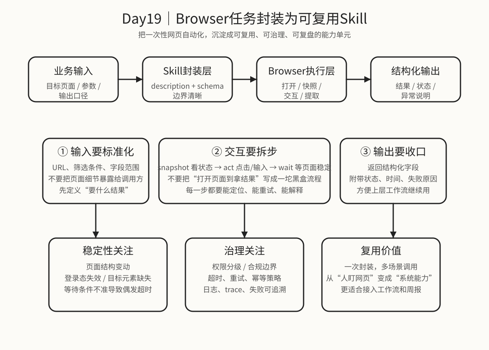

# Day 19｜Browser任务封装为可复用Skill

## 今日主题
前面几天我们已经把 Browser 自动化能力拆开看过：会打开页面、会抓取结构化信息、会做失败恢复，也知道批量流程里要考虑分页和合规。

但如果这些能力始终只停留在“这次手工跑通了”，它就还只是一次性操作，不是组织能力。

所以今天真正要解决的问题是：**如何把一个 Browser 任务，从临时脚本或临时流程，封装成一个可复用、可治理、可接入工作流的 Skill。**

这一步非常关键。因为浏览器自动化天然复杂：页面会变、登录态会过期、交互步骤多、失败点分散。如果没有统一封装，团队很快会出现几种典型问题：

- 同一个页面任务，每个人都写一版，逻辑重复且口径不一致
- 调用方只想要结果，却不得不理解页面细节和点击顺序
- 一旦页面改版，所有使用方一起坏掉
- 出问题时没人说得清是 Skill 设计问题、Browser 执行问题，还是目标页面变化

所以 Browser Skill 的价值，不是“把 Browser 套一层壳”，而是把网页自动化升级成：

**一个输入清晰、输出稳定、边界明确、能被复用和治理的能力单元。**

## 技术原理（技术视角）
### 1）为什么 Browser 任务更适合封装成 Skill
普通工具调用适合处理单步动作，比如打开网页、点击元素、截图、读取表格。

但真实业务里的 Browser 任务，通常不是一个动作，而是一串连续动作：
- 打开目标页面
- 判断当前登录态和页面状态
- 输入筛选条件或跳转到目标模块
- 读取页面结构化内容
- 对异常状态做等待、重试或退出说明
- 最终输出一个业务能消费的结果

如果每次都由上层流程临时拼接这些步骤，会有三个明显问题：

#### 问题一：调用方承担了过多页面细节
上层本来只关心“帮我拿到昨天新增工单列表”，不应该理解按钮名称、输入框 ref、等待时机、翻页顺序。

#### 问题二：页面变化会直接冲击业务流程
如果页面结构改了，所有直接依赖 Browser 动作的流程都会出问题；而封装成 Skill 后，至少可以把变化收敛在 Skill 内部。

#### 问题三：复用和治理成本高
没有 Skill，就很难统一描述、统一审批、统一监控和统一维护。浏览器自动化能力会变成一堆零散脚本，而不是资产。

所以，从工程视角看，Browser Skill 的本质是：

**把“页面交互过程”收敛为“标准能力接口”。**

### 2）一个可复用 Browser Skill，通常要包含哪些层
#### 第一层：输入层（Input Contract）
输入层决定 Skill 对外暴露什么能力。

一个好的 Browser Skill 输入，不会把页面实现细节原样暴露出去，而是用业务语言定义参数。例如：
- 查询日期范围
- 目标页面 URL
- 需要提取的字段范围
- 是否允许翻页/最大页数
- 输出格式要求（明细 / 汇总 / 状态）

输入层的关键原则有两个：
1. **对调用方友好**：参数最好贴近业务语义，而不是贴近页面按钮语义
2. **对 Skill 可控**：参数不能无限制放大页面权限或访问范围

也就是说，输入不是“你要怎么点页面”，而是“你希望 Skill 帮你完成什么结果”。

#### 第二层：交互层（Interaction Flow）
交互层是 Skill 内部真正调用 Browser 的部分。

成熟的交互层，通常不会写成一大段黑盒逻辑，而是拆成几个稳定步骤：
- 页面打开
- 状态识别
- 页面交互
- 内容提取
- 异常判断
- 结果归并

这里最关键的是：
- 每一步都要有明确目的
- 每一步都尽量能单独定位失败
- 每一步都要有最小必要等待，而不是无脑 sleep

如果你把所有动作一次性串起来，短期可能跑得通，但后面很难排查，也很难复用。

#### 第三层：结果层（Structured Output）
一个 Browser Skill 不应该只返回“网页看起来抓到了什么”，而应该返回上层流程能继续消费的结构化结果。

例如，输出里通常应包含：
- `status`：成功 / 失败 / 部分成功
- `data`：结构化明细或汇总结果
- `summary`：给业务看的摘要说明
- `meta`：抓取时间、页面来源、页数、耗时等元信息
- `error`：失败原因、失败位置、是否建议重试

结果层的意义是：
**把网页世界里的模糊状态，压缩成工作流世界里的确定结果。**

### 3）Browser Skill 和普通 Skill 的区别，难点主要在哪
#### 难点一：页面是活的，不是静态接口
API Skill 的输入输出通常稳定；Browser Skill 面对的是一个不断变化的前端页面。

这意味着它要额外处理：
- 页面加载过程
- 动态元素渲染
- DOM 结构变化
- 登录态与权限态
- 弹窗、遮罩、重定向

所以 Browser Skill 的稳定性设计，一定比普通文本处理或 API 查询更重要。

#### 难点二：失败往往不是“完全失败”，而是“部分可用”
比如：
- 页面打开成功，但筛选失败
- 列表拿到了前两页，第三页超时
- 主数据抓到了，但附加字段为空

Browser Skill 不能只返回成功/失败二元状态，还要能表达：
- 哪一步完成了
- 哪一步没完成
- 当前结果是否还能被业务部分使用

#### 难点三：可解释性要求更高
调用方往往不懂浏览器自动化细节。如果结果失败，只说“工具执行失败”是没有管理价值的。

更好的做法是返回类似这类信息：
- 登录态失效，需要人工重新登录
- 页面结构变化，原字段定位失败
- 筛选条件生效但结果为空
- 第 3 页超时，已返回前 2 页结果

这些说明会直接影响业务是否能继续使用结果、是否要人工补位、是否需要立项修复。

### 4）设计 Browser Skill 时，最值得提前想清楚的 5 件事
#### ① 这个 Skill 的业务边界是什么
不要做“万能网页操作助手”。越万能，越难稳定、越难治理。

更好的设计是一个 Skill 只负责一类清晰任务，例如：
- 抓某个页面的结构化列表
- 按固定筛选条件导出日报数据
- 检查页面状态并返回异常摘要

边界越清楚，复用价值越高。

#### ② 成功标准是什么
是拿到页面截图就算成功？还是必须返回结构化表格？
是抓到 80% 结果也能用？还是必须完整？

这个标准不提前定义，Skill 后面就会出现“技术说成功，业务说不能用”的冲突。

#### ③ 允许怎样的失败恢复
Browser Skill 通常至少要定义：
- 可以自动重试几次
- 哪些错误适合重试，哪些不适合
- 页面超时后是直接退出，还是先刷新再继续
- 失败后是否返回部分结果

#### ④ 哪些信息必须留痕
至少要能回看：
- 输入参数摘要
- 关键页面状态
- 抓取起止时间
- 失败点和失败原因
- 最终输出摘要

否则这个 Skill 一旦进入频繁使用阶段，后续维护会非常痛苦。

#### ⑤ 是否适合进一步接入工作流
一个 Browser Skill 真正有价值，不只是“能被手工调用”，而是：
- 能接 cron
- 能被其他 Skill 或 agentTurn 调用
- 能作为周报/日报流程中的一环
- 能在失败后触发通知或人工补位

如果设计时就考虑这些场景，后续整合成本会低很多。

### 5）常见失败点
#### 失败点一：把页面细节泄漏给调用方
例如要求调用方传按钮文案、DOM 路径、元素 ref。这说明 Skill 没有完成抽象，实际上只是把复杂度转嫁了出去。

#### 失败点二：输入输出没有稳定 Schema
没有 Schema，Skill 就很难被稳定调用，也很难接入更大的工作流。

#### 失败点三：只关心“跑通一次”，不关心“长期稳定”
很多 Browser 流程在开发当天都能跑通，问题往往发生在一周后：页面小改、登录态失效、字段位置变了。

#### 失败点四：错误信息不可用
如果报错只有一行“timeout”或“element not found”，对业务和运维都帮助很小。

#### 失败点五：没有最小权限和范围控制
一旦把 Skill 做成“随便打开任意页面、抓任意字段”，后面治理压力会非常大，也容易触碰合规边界。

## 业务翻译（业务视角）
### 这项能力解决什么问题
一句话：**把“靠人盯网页”升级成“系统可复用能力”。**

很多团队的浏览器自动化，早期看起来进展很快，因为只要有人能写脚本、能点页面，就能先做出结果。

但一旦业务开始依赖，就会暴露出典型管理问题：
- 某个人离开，这个流程没人敢改
- 同一类任务做了 3 个版本，数据口径不统一
- 出问题时只知道“网页任务坏了”，但不知道坏在哪
- 业务要接入日报/周报/告警，却发现没法稳定复用

Browser Skill 的作用，就是把这些碎片化流程标准化。

### 为什么业务会愿意用
因为业务真正需要的不是“浏览器很强”，而是这 4 件事：
- 我能不能稳定拿到结果
- 结果结构是不是固定、能不能直接继续用
- 出问题时能不能快速解释
- 这套能力能不能重复用在更多场景

如果 Browser 自动化只是某个人会的一套操作，它对业务价值有限；
如果被沉淀成 Skill，它就能进入组织资产池。

### 它带来的四类价值
- **提效**：同类网页任务不用反复开发，减少重复劳动
- **提质**：统一输入输出和异常说明，降低结果口径漂移
- **提速**：上层流程可以直接调用 Skill，不必每次重新编排页面步骤
- **可控**：更容易挂接权限、审计、日志和版本管理

## 典型场景（个人版）
### 场景 1：后台列表日报提取
每天都要从某个后台页面读取昨日新增记录，输出结构化日报。

如果只是临时脚本，每次页面小改都要返工；封装成 Browser Skill 后，上层只需要传日期范围和输出类型，流程更稳。

### 场景 2：页面状态巡检
定时检查某个业务页面是否可访问、是否出现关键异常文案、核心指标是否正常展示。

这类任务非常适合封装成 Skill，因为它需要固定动作、固定判断规则和固定输出结构。

### 场景 3：需要登录态的结构化抓取
某些数据无法靠轻量 fetch 拿到，必须走真实浏览器和登录态。此时直接暴露原始 Browser 步骤风险太高，更适合沉淀成有限边界的 Skill。

### 场景 4：作为更大工作流中的中间节点
例如“抓取后台数据 → 汇总 → 生成管理者版日报 → 发送通知”。

在这种链路里，Browser 最好不是一个裸动作，而是一个可被可靠调用的中间能力块。

## 官方资料（带看点）
### 本地文档（知识库镜像路径）
- [[03-Resources/效率工具/OpenClaw-30天学习手册/本地文档索引]] - 看点：先从索引看 Browser、Skills、Sessions 三类文档，建立“不是单工具，而是能力封装”的整体视角。
- [[03-Resources/效率工具/OpenClaw-30天学习手册/官方文档-本地镜像(节选)/tools__browser.md|tools__browser.md]] - 看点：重点看 snapshot、act、wait、状态判断这些基础动作，理解 Browser Skill 的底层积木。
- [[03-Resources/效率工具/OpenClaw-30天学习手册/官方文档-本地镜像(节选)/skills__overview.md|skills__overview.md]] - 看点：回看 Skill 的能力边界、Schema 设计和描述方式，理解为什么 Browser 任务要先抽象再封装。
- [[03-Resources/效率工具/OpenClaw-30天学习手册/官方文档-本地镜像(节选)/skills__development.md|skills__development.md]] - 看点：关注输入输出定义、错误处理、执行边界，避免 Browser Skill 只是在包脚本。
- [[03-Resources/效率工具/OpenClaw-30天学习手册/官方文档-本地镜像(节选)/tools__sessions.md|tools__sessions.md]] - 看点：复杂 Browser 任务适合放进独立会话或隔离执行，便于控制上下文、日志和失败恢复。

### 在线文档
- https://docs.openclaw.ai/docs/tools/browser - 看点：看 Browser 工具的 snapshot / act / navigate / wait 这些真实动作模型，理解 Browser Skill 的执行底座。
- https://docs.openclaw.ai/docs/concepts/skills - 看点：看 Skill 在平台中的角色定位，避免把封装理解成单纯脚本管理。
- https://docs.openclaw.ai/docs/guides/skills/build - 看点：看 Skill 的开发流程、输入输出 Schema 和错误设计思路，适合对照 Browser 场景落地。
- https://docs.openclaw.ai/docs/tools/sessions - 看点：复杂网页任务往往不是一次性调用，适合理解何时该放进独立 session 以提高稳定性。
- https://github.com/openclaw/openclaw - 看点：从项目整体结构理解 Browser、Skill、Session、治理边界是如何组合的，而不是把网页自动化当成孤立能力。

## 图示

这张图想表达的是：**Browser Skill 的价值不在“会不会点页面”，而在“能否把页面交互过程收敛成标准输入、稳定执行、结构化输出，并纳入治理与复用体系”。**

## 管理者关注点（成本 / 效率 / 风险）
### 成本
- Browser Skill 的前期成本会高于一次性脚本，因为要额外考虑 Schema、异常处理、日志留痕和复用边界
- 但只要同类网页任务会重复出现 3 次以上，封装价值通常就能覆盖初始投入
- 真正昂贵的不是“第一次封装”，而是长期重复维护多套相似但不一致的网页流程

### 效率
- 技术侧效率：减少重复造轮子，把页面细节集中在 Skill 内维护
- 业务侧效率：调用方直接拿业务结果，不必理解页面操作过程
- 协作效率：输入输出统一后，更容易把 Browser 节点塞进更大的自动化工作流里

### 风险
- 页面结构变化、登录态失效、加载波动，是 Browser Skill 的天然不稳定来源
- 如果输入边界设计过宽，容易让 Skill 变成“万能抓取器”，后续治理压力和合规风险都会上升
- 如果错误说明不够细，业务会把所有失败都理解成“系统不稳定”，从而失去信任

## 本日自检
1. 我是否能说清：为什么 Browser 任务一旦进入重复使用，就应该优先封装成 Skill，而不是一直靠临时脚本？
2. 我是否理解：一个成熟 Browser Skill 至少要设计输入层、交互层、结果层，而不是只把 Browser 调用包起来？
3. 我是否知道：Browser Skill 最难的不是“能打开页面”，而是“长期稳定、异常可解释、结果可复用”？

## 一句话总结
**把 Browser 任务封装成 Skill，本质上是在把一次性网页操作，升级成可复用、可治理、可接入工作流的组织能力。**
