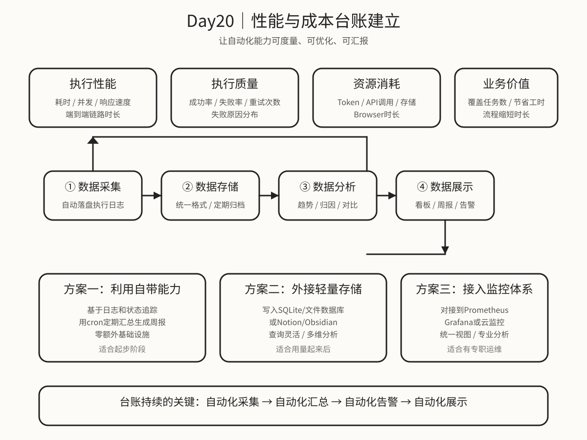

# Day 20｜性能与成本台账建立

## 今日主题
前面我们已经掌握了 Browser 自动化、Skill 封装、失败恢复、批量流程等核心能力。

但当这些自动化能力开始在组织内被频繁使用时，一个新问题会自然出现：**我怎么知道这些能力运行得好不好？花了多少成本？有没有优化空间？**

如果没有系统性的性能监控和成本台账，团队很快会陷入几种典型困境：
- 不知道某个 Skill 或流程实际跑了多少次、成败率多少
- 优化方向靠猜，没有数据支撑
- 成本失控不知道，等服务器账单来了才傻眼
- 业务方问"自动化帮我省了多少人天"，回答不上来

今天要解决的本质问题是：**如何建立一套轻量、可落地、可持续的性能与成本台账体系，让自动化能力可度量、可优化、可汇报。**

## 技术原理（技术视角）
### 1）OpenClaw 里的"性能"到底指什么
很多团队第一次想到"性能"时，会直接联想到服务器 CPU、内存、响应时间。但对 OpenClaw 这类 Agent 平台来说，性能的内涵更丰富：

#### 维度一：执行性能
- 单次 Skill 调用的耗时
- 完整工作流的端到端耗时
- Browser 自动化里的页面加载时间、等待时间
- 并发能力：同一时段能跑多少任务

#### 维度二：执行质量
- 成功率 / 失败率
- 失败原因分布（是权限问题、网络问题、还是目标页面变化）
- 平均重试次数
- 超时触发频率

#### 维度三：资源消耗
- Token 消耗量（prompt + completion）
- API 调用次数（外部工具调用）
- Browser 实例占用时长
- 存储占用（日志、截图、附件）

#### 维度四：业务价值
- 自动化覆盖的任务数
- 替代的人工工时
- 流程缩短时长
- 错误率下降幅度

这四个维度里，前三个偏技术指标，第四个偏业务价值。成熟的台账体系应该同时覆盖。

### 2）哪些数据值得记录
不是所有数据都值得记。记录太多会增加存储成本和维护负担，记录太少又不够做决策。

建议优先记录这三类数据：

#### 基础执行日志
每次 Skill 或流程执行，至少记录：
- 执行时间（起止）
- 执行结果（成功 / 失败 / 部分成功）
- 输入参数摘要（脱敏后）
- 输出结果摘要
- 耗时
- 调用来源（是谁 / 什么流程触发的）

这类数据是所有分析的基础，建议默认开启。

#### 成本明细
如果需要精细管理成本，至少记录：
- Token 消耗量（分 prompt / completion）
- 外部 API 调用次数和费用
- Browser 自动化时长
- 存储使用量

这类数据适合月度汇总，不需要逐条实时分析。

#### 质量趋势
用来判断需不需要优化：
- 成功率趋势（周 / 月）
- 平均耗时趋势
- 失败原因排行榜
- 超时高频节点

这类数据适合周报或月度复盘用。

### 3）如何低成本搭建台账
#### 方案一：利用 OpenClaw 自带可观测性
前面 Day06 讲过 OpenClaw 有日志和状态追踪能力。可以直接基于这些能力做轻量台账：

- 每次执行结束后，自动写一条结构化日志到指定位置
- 用 cron 定期汇总日志，生成周报
- 用 cron 定期统计成本数据

优势：零额外基础设施，利用现有能力
劣势：功能简单，适合刚开始做的团队

#### 方案二：外接轻量存储
如果需要更灵活的查询和可视化，可以把执行日志写入：
- 一个简易的 SQLite 或文件数据库
- 或者直接写入 Notion/Obsidian 作为个人知识库的一部分

优势：查询灵活，可以做多维度分析
劣势：需要额外维护一个存储目标

#### 方案三：接入正式监控体系
如果团队已有监控基础设施（如 Prometheus、Grafana、云监控），可以把 OpenClaw 的执行指标对接到现有体系：

优势：统一视图，和其他系统一起看
劣势：接入成本最高，适合有专职运维的团队

大多数团队建议从方案一或方案二起步，等用量起来了再考虑方案三。

### 4）台账要持续，关键靠自动化
最常见的失败模式是：团队在起步阶段很认真地记了一周Excel，然后就没有然后了。

让台账持续运转的诀窍是：
- **自动化采集**：执行日志自动落盘，不要手工填
- **自动化汇总**：周报自动生成，不要手工算
- **自动化告警**：异常指标自动推送，不要人工看
- **自动化展示**：关键指标放到显眼位置，随时能看

只要台账体系不需要人工干预太多，它就能长期跑下去。

### 5）常见失败点
#### 失败点一：记了太多不用的数据
一开始就追求"大而全"，定义了超级详细的日志Schema，结果：
- 开发和维护成本太高
- 实际复盘时根本用不上那么多字段
- 团队很快放弃

更好的做法是：从最小可用集开始，后面再迭代扩展。

#### 失败点二：数据分散，没有统一归集
不同 Skill、不同流程各自记录日志，格式还不一致，后面想做汇总分析时痛苦万分。

建议一开始就约定统一的日志格式，至少包括：时间、执行ID、技能/流程名、结果、耗时、来源。

#### 失败点三：只记技术指标，不记业务价值
如果台账里只有"调用次数""成功率""耗时"，那最多只能做技术优化，很难向业务方和管理层展示价值。

有条件的话，尽量把业务指标也纳入：自动化替代了多少人工工时、缩短了多少流程时长。

#### 失败点四：台账本身没人维护
建台账时热情高涨，后面没人管了，数据库满了、告警失效了、报表不更新了。

建议把台账本身的健康度也纳入监控：数据延迟、日增长率、存储剩余。

## 业务翻译（业务视角）
### 这项能力解决什么问题
一句话：**让自动化能力从"能用"升级到"可度量、可优化、可汇报"。**

很多团队引入 OpenClaw 的动机是"提效"，但如果提了多少效说不清楚，后面申请预算、争取资源、说服业务方继续用，都会很被动。

台账的价值，就是让提效这件事从模糊感受变成清晰数据。

### 为什么业务会愿意配合
因为业务最关心的问题，往往只有台账能回答：
- "自动化到底帮我省了多少事？"
- "这个流程现在跑得多快？比人工快多少？"
- "最近有没有出问题？都是什么问题？"
- "还要继续投钱吗？投多少合适？"

如果技术团队能准确回答这些问题，业务信任度会大幅提升，后续合作也会更顺畅。

### 它带来的四类价值
- **提效**：用数据指导优化方向，而不是靠猜
- **提质**：通过失败分析发现系统性问题和改进机会
- **提速**：自动化周报/月报，减少管理汇报的人工成本
- **可控**：成本透明，避免"用着用着突然超预算"

## 典型场景（个人版）
### 场景 1：Skill 性能复盘
某个关键 Skill 最近失败率突然上升，想定位原因。

如果有台账，可以直接看：
- 最近 7 天的成功率趋势
- 失败原因分布
- 是不是某个特定输入导致的批量失败

没有台账，就只能靠人工翻日志，效率极低。

### 场景 2：成本分析与优化决策
月底发现 Token 消耗比上个月涨了 50%，想知道为什么。

如果有台账，可以：
- 按 Skill 拆解消耗占比
- 定位消耗最高的流程
- 判断是业务量增长还是 Prompt 效率下降

### 场景 3：向管理层汇报自动化价值
季度汇报需要回答"自动化到底带来什么价值"。

如果有台账，可以量化展示：
- 自动化覆盖了多少流程
- 累计节省了多少人工工时
- 流程时效提升了百分之多少

### 场景 4：容量规划与预算申请
明年想扩大自动化范围，需要申请更多预算。

如果有历年台账数据做支撑，可以：
- 基于当前单价预测明年成本
- 基于业务增长预期推算用量
- 用数据而非故事去争取预算

## 官方资料（带看点）
### 本地文档（知识库镜像路径）
- [[03-Resources/效率工具/OpenClaw-30天学习手册/本地文档索引]] - 看点：先从索引了解 OpenClaw 的可观测性能力，为台账建立打基础。
- [[03-Resources/效率工具/OpenClaw-30天学习手册/官方文档-本地镜像(节选)/tools__logging.md|tools__logging.md]] - 看点：了解 OpenClaw 自带日志能力，能做什么、怎么用。
- [[03-Resources/效率工具/OpenClaw-30天学习手册/官方文档-本地镜像(节选)/tools__sessions.md|tools__sessions.md]] - 看点：了解会话级别的状态追踪，为精细化台账提供数据来源。
- [[03-Resources/效率工具/OpenClaw-30天学习手册/官方文档-本地镜像(节选)/concepts__observability.md|concepts__observability.md]] - 看点：理解 OpenClaw 可观测性的设计理念，知道哪些能力平台自带、哪些需要自己搭建。

### 在线文档
- https://docs.openclaw.ai/docs/concepts/observability - 看点：了解平台原生的可观测性能力边界。
- https://docs.openclaw.ai/docs/tools/sessions - 看点：看会话级别的日志和状态追踪如何利用。
- https://docs.openclaw.ai/docs/guides/monitoring - 看点：看官方推荐的监控和告警搭建方式。
- https://github.com/openclaw/openclaw - 看点：从项目结构了解有哪些可用的日志和指标接口。

## 图示

这张图想表达的是：**台账不是记流水账，而是建立一个"采集→存储→分析→展示→告警"的闭环，让自动化能力持续透明、持续可优化。**

## 管理者关注点（成本 / 效率 / 风险）
### 成本
- 台账本身的维护成本其实很低，主要是存储和定期汇总的轻微计算开销
- 最大的成本是"忘记建台账"--后面想优化时没有数据支撑，决策质量会很低
- 建议用最小可用方案先跑起来，等用量上来再升级

### 效率
- 技术侧效率：用数据指导优化方向，避免盲目调优
- 业务侧效率：自动化周报/月报，减少管理汇报的人工投入
- 协作效率：用统一台账替代零散的表格和口口相传，信息更透明

### 风险
- 如果台账数据不准确或不完整，反而会产生误导
- 如果只记不用，台账会成为负担而不是资产
- 如果台账本身没有安全防护（权限控制、日志脱敏），可能引入合规风险

## 本日自检
1. 我是否理解：OpenClaw 场景下的"性能"至少包括执行性能、执行质量、资源消耗、业务价值四个维度？
2. 我是否知道：从最小可用台账起步，先记录基础执行日志和关键成本指标，后期再迭代扩展？
3. 我是否明白：台账能否持续，关键不在"记多少"，而在"能不能自动化采集和汇总"？

## 一句话总结
**建立性能与成本台账，本质上是在把自动化能力从"模糊感觉"升级成"清晰数据"，让优化有方向、汇报有依据、决策有支撑。**
