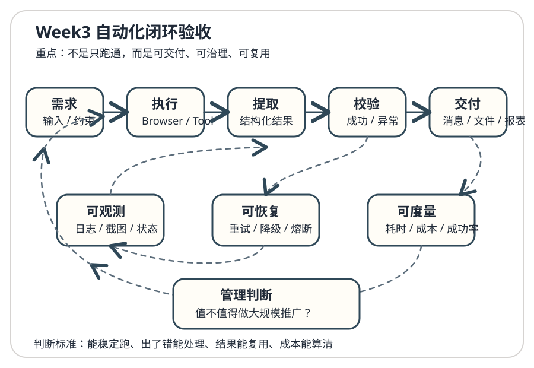

# Day 21｜Week3复盘：自动化闭环验收

## 今日主题
这一周的重点，不再是“把浏览器点起来”，而是把自动化能力做成**可验收、可复用、可治理**的闭环。前 6 天分别解决了 Browser 基础、结构化提取、失败恢复、批量处理、Skill 封装、性能与成本台账；今天要把这些零散能力收束成一个更完整的判断框架：**什么样的自动化，才算真正能进入业务流程。**

---

## 技术原理（技术视角）

### 1. 闭环不是“跑通一次”，而是“每次都可被管理”
在工程里，自动化闭环通常至少包含 6 个层次：

1. **触发**：谁发起任务，何时发起，是否可追踪。
2. **执行**：Browser/工具链如何真正完成动作。
3. **提取**：输出的数据是否结构化、可消费、可复用。
4. **校验**：怎么确认结果不是“表面成功、实际失败”。
5. **恢复**：失败时是重试、降级，还是中断等待人工介入。
6. **交付**：结果如何沉淀为消息、报表、文件、状态变更。

只有这 6 层打通，自动化才从“脚本”升级为“能力”。

### 2. Week3 六个主题，实际上对应一条工程化链路

| 日程 | 能力主题 | 在闭环中的位置 | 解决的核心问题 |
| --- | --- | --- | --- |
| Day15 | Browser 自动化基础 | 执行层 | 让系统具备对网页/系统界面的操作能力 |
| Day16 | 结构化提取 | 提取层 | 让输出变成可计算、可判断的数据 |
| Day17 | 失败恢复 | 恢复层 | 让任务在异常时不至于“一挂到底” |
| Day18 | 批量流程 | 放大层 | 让单次动作扩展为规模化执行 |
| Day19 | Skill 封装 | 复用层 | 让能力可复用、可组合、可交给别人调用 |
| Day20 | 成本台账 | 治理层 | 让自动化能被算账、比较、决策 |

### 3. 自动化闭环的真实运行机制
一个可靠的自动化任务，不应只有一串步骤，而应有明确的状态流转：

- **接收需求**：输入参数、上下文、约束条件
- **拆解步骤**：导航、登录、定位、点击、提取、校验
- **产生证据**：日志、截图、结构化结果、错误码
- **判断结果**：成功、部分成功、失败、需人工确认
- **决定后续动作**：结束、重试、降级、升级告警

这背后的核心思想是：

- **可观测**：知道任务进行到哪一步
- **可追溯**：知道为什么成功或失败
- **可恢复**：知道失败后下一步做什么
- **可度量**：知道这件事值不值得继续自动化

### 4. 常见误区

#### 误区 A：流程能跑通，就算完成
不对。能跑通只是“功能完成”，不是“交付完成”。如果没有日志、失败码、重试策略，任务一旦出问题，只能靠人猜。

#### 误区 B：成功率高就代表适合推广
也不对。自动化是否值得推广，要看：
- 单次节省多少人工时间
- 失败时人工接管成本高不高
- 页面变化后维护成本大不大
- 是否涉及敏感操作或审批链

#### 误区 C：批量化只是加个循环
批量化真正增加的是治理复杂度：分页、限流、幂等、异常隔离、进度追踪，缺一不可。

---

## 业务翻译（业务视角）

### 这项能力本质上解决什么问题
如果只会做单点自动化，业务会觉得这是一段“演示用脚本”；如果能形成闭环，业务会开始把它当成**可托付的生产能力**。

换成业务语言，这一周其实回答了 4 个问题：

1. **能不能做？** —— Browser 自动化解决“能操作”。
2. **做完后结果能不能用？** —— 结构化提取解决“能消费”。
3. **出错了怎么办？** —— 恢复机制解决“能兜底”。
4. **值不值得持续投入？** —— 成本台账解决“能决策”。

### 为什么业务更容易理解并接受
业务并不关心 DOM、Selector、超时策略这些底层细节，业务关心的是：

- 这件事以后是不是不用人盯着做了？
- 失败了会不会悄悄出错、没人知道？
- 能不能批量跑、稳定跑、持续跑？
- 这套东西是不是一做就是长期资产，而不是一次性 demo？

闭环化设计，恰好把这些担心逐一消掉。

### 对业务的直接价值

- **提效**：把重复点击、重复录入、重复核对变成机器流程。
- **提质**：通过结构化校验，降低人工漏看、错看、漏抄。
- **提速**：从“按人排队处理”变成“系统并发处理”。
- **可控**：有日志、有状态、有回执，出了问题能快速定位。
- **可复制**：一次封装成 Skill，后续可迁移到更多场景。

---

## 典型场景（个人版）

### 场景 1：竞品运营监控
每天定时抓取竞品页面的价格、库存、活动信息。不是简单抓一遍，而是形成完整闭环：
- 定时触发任务
- 抓取并结构化存档
- 对比昨日差异
- 超阈值时推送提醒
- 失败时自动重试并保留截图证据

### 场景 2：内部管理后台批量处理
例如批量审核订单、批量核销记录、批量导出日报：
- 系统自动读取待处理列表
- 按规则执行批量操作
- 对每一条操作结果进行记录
- 部分失败自动重跑
- 最终汇总成功数、失败数、失败原因

### 场景 3：跨系统对账或搬运
当两个系统没有开放 API，Browser 自动化就能成为临时的“连接层”：
- 从 A 系统读取数据
- 按结构映射到 B 系统
- 关键字段二次校验
- 异常项输出待复核清单
- 形成日常对账/同步流程

### 场景 4：管理者固定节奏报表
把“每周固定从多个后台抄数据再整理成汇报”的过程自动化：
- 固定时间触发
- 多系统抓取
- 表格结构统一
- 自动生成简版管理视图
- 只把异常项留给人判断

---

## 官方资料（带看点）

### 本地文档（知识库镜像路径）
- [[03-Resources/效率工具/OpenClaw-30天学习手册/官方文档-本地镜像(节选)/tools__browser.md]]  
  看点：回看 Browser 工具的核心动作集合，理解自动化执行层到底能做什么。
- [[03-Resources/效率工具/OpenClaw-30天学习手册/官方文档-本地镜像(节选)/tools__skills.md]]  
  看点：理解为什么单点流程必须封装成 Skill，才能进入复用和治理阶段。
- [[03-Resources/效率工具/OpenClaw-30天学习手册/官方文档-本地镜像(节选)/tools__creating-skills.md]]  
  看点：看 Skill 的输入/输出组织方式，理解“自动化资产化”的方法。
- [[03-Resources/效率工具/OpenClaw-30天学习手册/官方文档-本地镜像(节选)/concepts__architecture.md]]  
  看点：从架构角度回看执行、工具、消息与会话之间的关系。

### 在线文档
- https://docs.openclaw.ai/docs/tools/browser  
  看点：Browser 工具动作、参数和控制方式。
- https://docs.openclaw.ai/docs/tools/skills  
  看点：Skill 如何把一次能力变成长期能力。
- https://docs.openclaw.ai/docs/guides/creating-skills  
  看点：从最小可用 Skill 到可维护 Skill 的设计路径。
- https://github.com/openclaw/openclaw  
  看点：结合仓库结构理解官方能力边界与演进方向。

---

## 图示

这张图建议重点看两层：
- **上层主流程**：需求进入后，如何经过执行、提取、校验后形成交付。
- **下层治理回路**：失败、异常、成本、日志并不是附属品，而是自动化能不能持续跑下去的关键。 

---

## 管理者关注点（成本 / 效率 / 风险）

### 1. 成本
管理者不要只看“自动化是不是很酷”，而要看单位收益：

- 单次任务节省的人力时间是多少？
- 为维持这条自动化，需要多少维护成本？
- 页面变动频率高不高？
- 是否需要长期登录态、代理、验证码处理等额外投入？

**建议做法：**
先给每条自动化建立简单台账：任务频次、单次耗时、人工替代时长、失败率、维护频次。很多自动化值不值得做，一算就知道。

### 2. 效率
好的自动化不是“比人快一点”，而是把人从低价值重复动作里解放出来，让人只处理判断和例外。

管理上重点关注：
- 是否把高频重复动作优先自动化
- 是否能把结果直接接入原有协作链路
- 是否减少了跨系统抄录、复制、比对
- 是否缩短了从“发现问题”到“执行动作”的路径

### 3. 风险
自动化一旦进入真实业务，就必须明确边界：

- 是否涉及敏感数据读取
- 是否涉及批量修改、批量删除、批量审批
- 是否有审批前置或人工确认环节
- 是否能保留完整审计线索

**底线建议：**
高风险动作必须具备人工确认点；高频任务必须具备失败告警；关键流程必须具备可追溯证据。

---

## 本日自检
1. 我能否用“触发—执行—提取—校验—恢复—交付”解释一个自动化闭环？
2. 我是否能区分“脚本跑通一次”和“能力可长期运营”的差别？
3. 如果让我评估一个自动化值不值得继续投入，我是否知道该看成本、效率、风险哪几个指标？
4. 我是否能举出一个自己工作里适合做闭环自动化，而不只是单次脚本的场景？

---

## 一句话总结
自动化真正的门槛，不是把流程跑起来，而是把它做成**能交付、能治理、能长期复用**的业务能力。