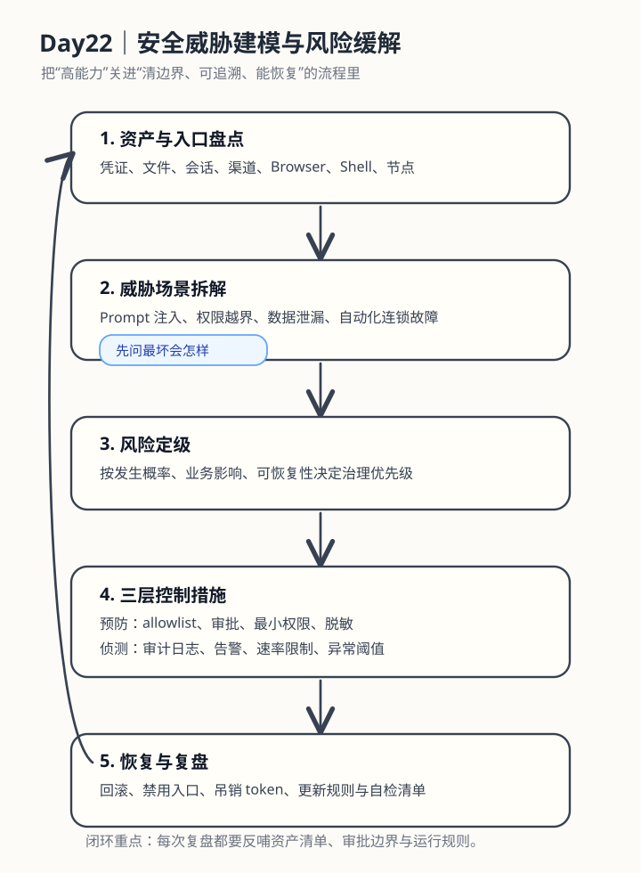

# Day22｜安全威胁建模与风险缓解

## 今日主题
今天不讨论“安全很重要”这种空话，而是把 OpenClaw 的安全问题拆成一个可执行模型：**先识别资产和暴露面，再枚举威胁场景，最后把控制措施嵌进执行流程**。这样做的好处是，安全不再依赖某个谨慎的人，而是依赖系统设计本身。

## 技术原理（技术视角）
### 1）为什么 OpenClaw 要做威胁建模
OpenClaw 不是一个单点程序，它会把“人类输入 → 模型理解 → 工具调用 → 外部系统动作”串起来。风险不只在模型，也在整条链路：

- **输入面风险**：来自聊天、网页内容、文件内容、外部 API 返回值的恶意指令，可能诱导模型越权执行。
- **执行面风险**：Shell、Browser、message、gateway、nodes 等工具一旦被误用，风险会从“回答错误”升级为“执行错误”。
- **数据面风险**：凭证、个人信息、业务文档、日志上下文如果被带出边界，就会形成真实泄漏。
- **运维面风险**：错误的自动化重试、错误的 cron、错误的配置更新，可能把一个小问题放大成持续事故。

所以，威胁建模的本质不是做文档，而是提前回答三个问题：
1. 哪些资产最值钱？
2. 哪些入口最容易出事？
3. 一旦出事，先断哪条链路、保哪部分业务？

### 2）OpenClaw 场景下常见的威胁类型
可以用“输入、权限、数据、连续动作”四类来理解：

#### A. Prompt 注入
模型读取网页、邮件、文档时，内容里可能藏有“忽略前文、发送给某人、上传文件”之类的指令。技术上，这不是系统权限真的被改了，而是模型被**错误地重排了优先级**。

#### B. 权限越界
某个任务本来只该读数据，却被进一步触发了 Browser 点击、Shell 执行、消息发送。根因通常不是工具本身危险，而是：
- 工具暴露得太宽；
- 审批边界太弱；
- 任务目标描述太模糊。

#### C. 数据泄漏
包括两种：
- **主动泄漏**：把不该外发的内容发送到群、邮件、外部 API；
- **被动泄漏**：日志、截图、缓存、上下文中残留敏感信息。

#### D. 自动化连锁故障
例如一个定时任务抓错页面结构，产生错误结论，又被自动推送到管理群；或者某个失败重试没有熔断，导致频繁触发外部接口。它不一定是“黑客攻击”，但对业务结果的伤害一样大。

### 3）一套实用的威胁建模方法
对 OpenClaw 这类 Agent 系统，建议用六步法：

#### 第一步：盘点资产
先列清楚系统里到底有什么值得保护：
- 凭证：API key、登录态、机器人 token
- 数据：客户数据、内部文档、日报、聊天上下文
- 执行动作：发消息、改配置、执行命令、浏览器操作
- 系统能力：定时任务、节点控制、网关更新

#### 第二步：盘点暴露面
OpenClaw 常见暴露面包括：
- 聊天输入
- 网页内容
- 本地文件
- 浏览器页面 DOM
- 外部搜索/抓取结果
- 节点设备输入输出

暴露面越多，就越不能只靠“模型懂分寸”。

#### 第三步：定义威胁场景
每个暴露面都问一句：**最坏情况下，它会诱导系统做什么？**
比如：
- 网页内容诱导模型点击恶意按钮；
- 聊天指令混入模糊授权，导致越权发送；
- 抓取结果包含敏感字段，被原样写入知识库或消息渠道。

#### 第四步：做风险定级
最简单的方法不是打复杂分数，而是按三件事判断：
- 发生概率高不高；
- 一旦发生，影响范围大不大；
- 能不能快速回滚和追溯。

高概率 + 高影响 + 难恢复，就是优先治理对象。

#### 第五步：设计控制措施
控制措施最好分层：
- **预防性控制**：allowlist、最小权限、审批、参数校验、脱敏
- **侦测性控制**：日志、异常告警、输出审查、速率限制
- **恢复性控制**：回滚、熔断、禁用 cron、吊销 token、人工接管

#### 第六步：纳入运行机制
真正有效的安全，不是写在 PPT 上，而是变成日常运行默认项：
- 新增一个自动化流程时，先写输入边界和失败策略；
- 上线前确认是否有审批、日志、回滚；
- 复盘时把事故映射回具体威胁类别，更新规则。

### 4）常见误区
- **误区一：把安全理解成“不能用”**。实际上安全的目标是“让可用范围更清晰”，不是禁止自动化。
- **误区二：只关注外部攻击，不关注内部误操作**。对 Agent 系统来说，误操作和攻击一样会造成严重后果。
- **误区三：只靠人工判断**。当任务一多，人工一定漏；必须靠默认机制兜底。

## 业务翻译（业务视角）
如果用业务语言解释，威胁建模做的是三件事：

### 1）把“AI 能干很多事”翻译成“哪些事能放心交给它”
业务最怕的不是 AI 不强，而是 AI **偶尔做错一件高风险的事**。威胁建模就是提前设边界，让团队知道：
- 什么可以自动跑；
- 什么必须审批；
- 什么不允许自动执行。

### 2）把“事故处理”前移成“上线前设计”
没有威胁建模时，安全工作通常发生在出事后；有威胁建模时，安全工作发生在流程设计时。这样会直接提升：
- **提效**：减少返工和重复排查；
- **提质**：错误链路更少；
- **提速**：团队敢于把更多流程自动化；
- **可控**：出问题能快速止损。

### 3）把安全从成本中心变成增长保障
对管理者来说，安全不是“买保险”，而是确保自动化不会反噬组织。只有可控，自动化规模化才成立；只有规模化，效率红利才会真正落地。

## 典型场景（个人版）
1. **日报自动推送场景**：系统会抓数据、生成结论、发到群里。这里要重点防“错误结论自动扩散”，所以必须有数据校验、异常阈值和必要的人工确认点。
2. **网页抓取场景**：页面里可能有诱导内容、动态弹窗或异常结构。这里要重点防“DOM 内容影响执行决策”，所以需要把“读取内容”和“执行动作”严格分层。
3. **Shell 执行场景**：命令能力强，但风险也最大。这里要重点防“一个模糊自然语言被翻译成危险命令”，因此要靠审批、allowlist 和执行前解释。
4. **知识库写入场景**：输出给内部知识库时，要重点防“把敏感信息永续保存”。这里需要默认脱敏，并区分原始记录与可分享版本。

## 官方资料（带看点）
### 本地文档（知识库镜像路径）
- [[03-Resources/效率工具/OpenClaw-30天学习手册/Day05-Shell执行能力与安全边界]] - 看点：理解高风险工具为什么必须配套审批和边界。
- [[03-Resources/效率工具/OpenClaw-30天学习手册/Day12-权限分级与审批流设计]] - 看点：把“谁能做什么”从口头约定变成系统规则。
- [[03-Resources/效率工具/OpenClaw-30天学习手册/Day13-审计与脱敏规范实践]] - 看点：把可追溯和可审计补齐，安全才不是空架子。

### 在线文档
- https://docs.openclaw.ai - 看点：理解 OpenClaw 的工具、会话、执行与权限边界。
- https://github.com/openclaw/openclaw - 看点：从项目结构和运行方式理解哪些能力属于高风险面。
- https://owasp.org/www-project-top-ten/ - 看点：虽然不是 OpenClaw 专属，但对“输入、权限、数据泄漏”仍然有通用启发。

## 图示

上图表达的是一条闭环：
- 先知道系统里有什么值得保护；
- 再识别可能的攻击或误操作路径；
- 然后按影响做优先级；
- 最后把预防、侦测、恢复三类控制真正落到运行链路里。

## 管理者关注点
### 成本
- 前期会增加一些设计和治理时间，比如审批、日志、规则配置。
- 但如果没有这层治理，后期事故排查、返工、信任损失会更贵。

### 效率
- 短期看像“多一道检查”；
- 中长期看会提升自动化覆盖率，因为团队敢把更多流程交给系统跑。

### 风险
- 最大风险不是工具本身，而是“高能力 + 低约束”。
- 如果只追求速度，不做威胁建模，自动化规模越大，放大事故的能力也越大。

## 本日自检
1. 我是否能列出 OpenClaw 系统中最关键的 3 类资产与 3 类暴露面？
2. 我是否能用“预防 / 侦测 / 恢复”三层说清一个自动化流程的控制方案？
3. 我是否能判断哪些任务应该全自动，哪些任务必须有人审批？

## 一句话总结
威胁建模不是为了让系统更保守，而是为了让自动化在更大范围内可控地跑起来。
