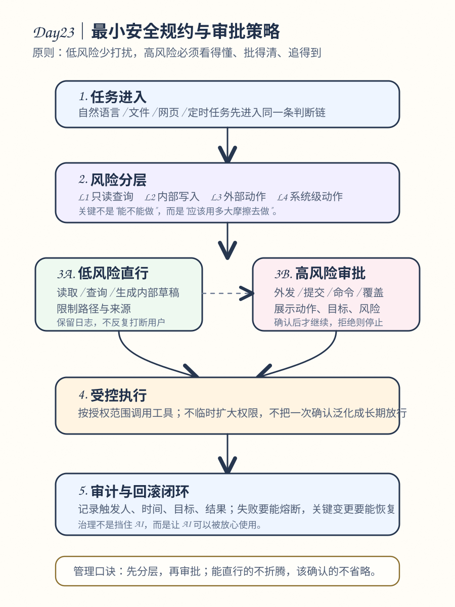

# Day 23｜最小安全规约与审批策略

## 今日主题
前一天我们解决的是“风险从哪里来”，今天要解决的是“系统该如何默认做对”。对 OpenClaw 这类 Agent 系统来说，真正能落地的安全，不是写一堆泛泛规则，而是形成一套**最小安全规约**：让系统先天知道什么能做、做到什么程度、在哪些点必须停下来等人确认。这样，自动化不是靠运气安全，而是靠机制安全。

## 技术原理（技术视角）
### 1）什么叫“最小安全规约”
最小安全规约可以理解为一组默认生效的底线规则，它不追求把所有情况都覆盖得极其复杂，而是先解决最常见、最危险、最容易失控的那部分问题。它通常包含四层：

- **身份边界**：谁发起的任务、来自哪个渠道、是否在允许名单内。
- **能力边界**：这个任务允许调用哪些工具，只读、只写，还是可执行外部动作。
- **数据边界**：输入里哪些内容能用，输出里哪些内容不能外发，哪些字段必须脱敏。
- **审批边界**：哪些动作可以自动执行，哪些动作必须先停下来获得明确确认。

“最小”并不等于“简单粗暴”，而是强调：**先把底线打牢，再逐步放开高价值能力**。如果一开始把工具权限、外发权限、执行权限都放得过宽，后面再补规则，治理成本会更高。

### 2）为什么 Agent 系统必须把审批策略产品化
传统系统里，审批往往是流程系统的一部分；但在 OpenClaw 这种“自然语言驱动 + 工具执行”的系统里，审批不能只靠人的经验判断，而要内建到执行链路。

原因在于：
- 用户的自然语言经常是模糊的，例如“帮我处理一下”“你直接发出去吧”；
- 模型会努力完成目标，如果边界不清，容易把“建议”推进成“执行”；
- 工具能力一旦包含 Shell、message、browser、gateway、nodes，风险等级差异很大，不能一把尺子管理。

所以审批策略的本质不是“卡流程”，而是**把模糊意图转换成明确授权**。

### 3）一套实用的分级方法：按动作风险分层
在 OpenClaw 场景里，建议把动作拆成四级：

#### L1：低风险读取
特征：
- 只读，不改状态；
- 不对外发送；
- 不涉及敏感数据外泄。

典型动作：
- 读取本地非敏感文档；
- 查询状态、读取日志、查看目录；
- 拉取公开网页内容。

策略：
- 默认允许；
- 保留基础日志；
- 对读取来源做边界说明，防 prompt 注入。

#### L2：中风险内部写入
特征：
- 会修改本地文件、知识库、内部草稿；
- 影响可回滚，但不会直接对外。

典型动作：
- 写学习文档；
- 更新知识库；
- 生成报告草稿。

策略：
- 默认可执行，但建议记录变更对象；
- 对目标路径做约束；
- 涉及敏感内容时先脱敏再写入。

#### L3：高风险外部动作
特征：
- 会向外部系统发送消息、提交表单、调用写接口；
- 一旦发出，影响难完全回收。

典型动作：
- 发 Telegram / Slack / 邮件消息；
- 在网页上点击“提交 / 发布 / 支付”；
- 调用外部系统写接口。

策略：
- 需要显式审批或高置信规则；
- 执行前展示目标、内容摘要、接收方；
- 失败与成功都要可追溯。

#### L4：极高风险系统级动作
特征：
- 能改环境、改配置、执行命令、控制节点；
- 可能导致服务中断、数据破坏或权限扩大。

典型动作：
- 执行 Shell 命令；
- gateway 配置变更与重启；
- 节点设备控制；
- 批量删除、覆盖式更新。

策略：
- 强制审批；
- 必须附带具体命令或变更内容；
- 优先 allowlist；
- 执行后必须有审计记录和回滚方案。

这套分层的关键价值是：**不同风险，用不同摩擦**。低风险别把效率卡死；高风险别用一句“继续”就放过去。

### 4）审批策略怎么设计才不会把体验做坏
审批并不是越多越安全。审批设计得不好，会出现两个问题：
1. 用户嫌烦，开始机械同意；
2. 真正高风险动作反而淹没在大量低价值确认里。

所以审批策略要遵循三个原则：

#### 原则一：只在关键跃迁点审批
重点拦截的是：
- 从“读”变成“写”；
- 从“内部写”变成“外部发”；
- 从“内容处理”变成“系统执行”；
- 从“单次动作”变成“批量 / 定时 / 持续动作”。

#### 原则二：审批信息必须可判断
审批弹出来时，用户必须一眼看懂三件事：
- 要做什么；
- 对谁/哪里做；
- 风险是什么。

例如审批不该只写“是否继续执行”，而应该写成：
- 将向 **某群组** 发送 **日报摘要**；
- 将执行命令 **openclaw gateway restart**；
- 将覆盖 **某路径下 15 个文件**。

#### 原则三：审批结果要可复用但不能无限放大
常见做法包括：
- 对某类低风险动作设短期放行；
- 对高风险动作仍保持逐次确认；
- 对 allow-once 和 allow-always 做清楚区分。

本质上，审批策略既要减少重复摩擦，也要防止“一次授权，处处通行”。

### 5）最小安全规约的落地清单
对 OpenClaw 的实际运行，可先落这 8 条底线：

1. **渠道与来源白名单**：只处理允许的来源与会话。
2. **工具按需暴露**：默认少给，不默认全给。
3. **外发动作需确认**：消息发送、网页提交、外部写接口默认审批。
4. **系统级动作强审批**：Shell、gateway、nodes 等必须显式确认。
5. **输出默认脱敏**：日志、报告、知识库内容默认去掉凭证和隐私字段。
6. **关键动作留痕**：至少记录触发人、时间、目标、结果。
7. **失败要能熔断**：定时任务和批量任务不能无限重试。
8. **高风险任务可回滚**：配置变更、批量写入要有恢复路径。

这 8 条看起来朴素，但足以覆盖绝大多数早期自动化事故。

### 6）常见失败点
- **失败点一：规则写了，但没有嵌进执行链路**。文档有规定，系统却没拦截，等于没有。
- **失败点二：审批描述太抽象**。用户看不懂风险，只会一路点通过。
- **失败点三：低风险也频繁审批**。最终把审批机制自己消耗掉。
- **失败点四：只关注执行前，不关注执行后**。没有审计、没有回滚，出了事仍然被动。

## 业务翻译（业务视角）
### 1）这项能力解决的核心问题
它解决的不是“AI 会不会做事”，而是“AI 做事能不能被组织放心接纳”。如果没有最小安全规约，自动化项目很容易陷入两个极端：
- 要么完全放开，迟早出事故；
- 要么被一次事故打回人工，后续谁也不敢继续推。

最小安全规约的价值，就是让自动化具备组织级可用性：
- 低风险任务跑得更快；
- 高风险任务卡在明确确认点；
- 出问题时能追到责任链路。

### 2）为什么业务能理解并愿意使用
业务团队通常不关心底层模型细节，他们关心的是：
- 会不会误发；
- 会不会泄密；
- 会不会越权；
- 出错了谁能兜住。

审批策略把这些担心翻译成清晰机制后，业务会更愿意把真实工作流交给系统，而不只是把它当“问答机器人”。

### 3）提效 / 提质 / 提速 / 可控价值
- **提效**：低风险任务不用层层问人，减少人工确认成本。
- **提质**：关键动作被明确校验，减少“差一点就出事”的错误。
- **提速**：组织更敢开放自动化边界，规模化推进更快。
- **可控**：每类动作有明确治理方式，出了问题也能快速收敛。

## 典型场景（个人版）
1. **知识库日更场景**：自动写文档、生成图示、更新索引。这类是内部写入，可默认放行，但要限制目标目录、记录改动对象，并避免把敏感内容写入公开可分享材料。
2. **日报群发场景**：自动整理数据后准备发到管理群。这类属于外部动作，必须在发送前展示接收方、摘要内容和可能风险，必要时要求人工确认。
3. **环境维护场景**：需要执行命令、更新配置或重启服务。这类属于系统级动作，不能只接受“帮我修一下”这种模糊授权，必须展示具体命令或配置变更。
4. **批量抓取场景**：系统会连续访问多个页面并生成结果。这里不仅要审批是否允许外部访问，还要设并发、速率、失败熔断，避免任务失控。

## 官方资料（带看点）
### 本地文档（知识库镜像路径）
- [[OpenClaw-30天学习手册/官方文档-本地镜像(节选)/security__THREAT-MODEL-ATLAS.md|security__THREAT-MODEL-ATLAS.md]] - 看点：从威胁建模角度理解为什么 Agent 需要默认最小权限、明确边界和可追溯记录。
- [[OpenClaw-30天学习手册/官方文档-本地镜像(节选)/tools__exec.md|tools__exec.md]] - 看点：理解 Shell / 命令执行类工具为什么属于系统级高风险能力，必须有审批与审计。
- [[OpenClaw-30天学习手册/官方文档-本地镜像(节选)/tools__index.md|tools__index.md]] - 看点：从工具目录视角看，不同工具天然对应不同风险等级，不能用同一套放行策略。
- [[OpenClaw-30天学习手册/官方文档-本地镜像(节选)/concepts__session.md|concepts__session.md]] - 看点：审批和权限判断必须落到具体会话与上下文里，避免授权被跨场景放大。
- [[03-Resources/效率工具/OpenClaw-30天学习手册/Day12-权限分级与审批流设计]] - 看点：把权限边界和审批节点系统化，避免“谁都能顺手做”。
- [[03-Resources/效率工具/OpenClaw-30天学习手册/Day22-安全威胁建模与风险缓解]] - 看点：先识别风险来源，再决定哪些动作要拦，逻辑更完整。

### 在线文档
- https://docs.openclaw.ai/security/THREAT-MODEL-ATLAS - 看点：对照 Agent 系统常见威胁，检查最小安全规约是否覆盖关键风险。
- https://docs.openclaw.ai/tools/exec - 看点：理解命令执行工具的能力边界、风险点和审批必要性。
- https://docs.openclaw.ai/tools - 看点：按工具类型建立风险分级，而不是把所有能力默认等价处理。
- https://docs.openclaw.ai/concepts/session - 看点：理解会话上下文如何影响授权、执行和审计。
- https://github.com/openclaw/openclaw - 看点：从工程结构理解为什么不同工具应有不同风险分级。

## 图示

这张图重点表达的是：
- 任务先按风险分层；
- 低风险动作直接进入受控执行；
- 高风险动作进入审批节点；
- 执行完成后统一进入审计与回滚闭环。

## 管理者关注点（成本 / 效率 / 风险）
### 成本
- 初期需要花时间梳理风险分级、审批规则和日志字段；
- 但相比事故处理、信任受损和人工返工，这部分治理成本是低的。

### 效率
- 正确的做法不是“处处审批”，而是“高风险审批、低风险直行”；
- 一旦分级清楚，整体效率通常会上升，而不是下降。

### 风险
- 最大风险是审批设计失真：该拦的不拦，不该拦的全拦；
- 第二个风险是审批信息不透明，导致用户机械同意，审批流失去意义。

## 本日自检
1. 我是否能把一个 Agent 任务拆成低风险读取、内部写入、外部动作、系统级动作四类？
2. 我是否能说清哪些节点必须审批，哪些节点应该默认放行？
3. 我是否知道一条有效审批信息至少要包含“动作、目标、风险”三部分？

## 一句话总结
最小安全规约的目标，不是让系统什么都不能做，而是让不同风险级别的动作都在正确的摩擦下运行。