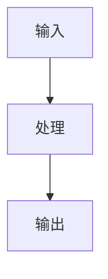

# Day 24｜环境隔离与Secrets管理

## 今日主题
（围绕「技术机制 + 业务可理解价值」展开）

## 技术原理（技术视角）
- 核心机制：
- 关键组件：
- 常见失败点：

## 业务翻译（业务视角）
- 这项能力解决的核心问题：
- 对效率/质量/速度/可控的影响：

## 典型场景（个人版）
1. 
2. 

## 推荐官方资料
- 本地文档：
- 在线文档：https://docs.openclaw.ai

## 关键流程图

## 管理者关注点
- 成本：
- 效率：
- 风险：

## 本日自检
- 我是否能复述本日关键机制？
- 我是否能说清业务价值？
- 我是否知道下一步要补的能力？
