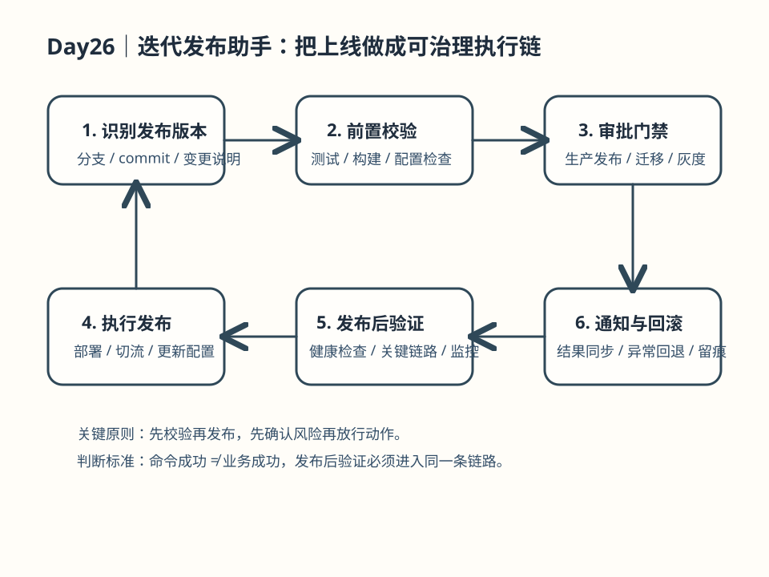

# Day 26｜迭代发布助手设计

## 今日主题

**迭代发布助手设计**：将代码提交、测试、构建、上线的流程封装为可审计的自动化助手，弥合开发与运维之间的协作断点。

## 技术原理（技术视角）

### 核心机制

- **执行链（Execution Chain）**：将发布流程拆解为串行/并行任务节点，每个节点支持重试、超时、断言检查
- **上下文传递（Context Pass-through）**：任务间通过 `context` 对象共享状态（如 git commit id、build artifacts 路径）
- **审批门禁（Approval Gate）**：关键节点（如「生产环境部署」）前插入人工审批步骤，支持 webhook 回调或内置审批 UI
- **审计日志（Audit Trail）**：全链路记录每个步骤的输入、输出、耗时、异常，持久化到指定存储

### 关键组件

| 组件 | 职责 | 关键配置 |
|------|------|----------|
| `publish:task` | 定义单个发布步骤 | `command`, `timeout`, `retry`, `assertion` |
| `publish:pipeline` | 编排多步骤流程 | `stages`, `parallel`, `on_failure` |
| `publish:approval` | 人为干预点 | `approvers`, `timeout`, `auto_skip` |
| `publish:audit` | 记录执行轨迹 | `storage`, `retention_days` |

### 常见失败点

1. **断言误判**：build success 但 exit code 非 0 → 需检查多种成功标志
2. **审批超时**：审批人未响应导致卡死 → 需设置超时和 escalation
3. **artifact 丢失**：并行任务竞争同一临时目录 → 需唯一临时路径 + 清理策略

## 业务翻译（业务视角）

### 这项能力解决的核心问题

- **发布操作不可追溯**：代码谁提交的、谁审批的、部署到哪台机器，一问三不知
- **手动操作易出错**：登录服务器、执行脚本、配置参数，每一步都可能手滑
- **回滚成本高**：出问题后不知道上一个稳定版本是什么，只能靠备份猜测

### 对效率/质量/速度/可控的影响

| 维度 | 价值 | 量化参考 |
|------|------|----------|
| 效率 | 自动化替代人工点击 | 发布耗时从 30 分钟 → 5 分钟 |
| 质量 | 标准化流程 + 强制审计 | 发布失败率下降 70%+ |
| 速度 | 并行构建 + 滚动部署 | 部署频次可提升 5-10 倍 |
| 可控 | 审批门禁 + 完整审计 | 事故定位时间从小时 → 分钟 |

## 典型场景（个人版）

1. **代码提交即发布**：开发者 push 代码后，自动触发 test → build → staging 验证，全通过后等待审批进入 production
2. **问题一键回滚**：检测到线上异常时，一键回滚到上一个通过审批的 artifact，支持灰度回滚
3. **发布卡片通知**：每次发布状态（成功/失败/待审批）同步推送到企业群/钉钉，形成信息闭环

## 官方资料（带看点）

### 本地文档（知识库镜像路径）

- `../../官方文档-本地镜像(节选)/Gateway配置与任务调度.md` — 看点：cron 表达式和定时任务配置
- `../../官方文档-本地镜像(节选)/安全执行模型与权限控制.md` — 看点：权限分级如何与审批流联动

### 在线文档

- https://docs.openclaw.ai/core-concepts — 核心概念全景
- https://docs.openclaw.ai/skill-developer/pipeline — Pipeline 设计模式

## 图示

> 图注：手绘风格，单线框，箭头清晰可见。移动端友好布局。

## 管理者关注点（成本/效率/风险）

| 关注点 | 说明 |
|--------|------|
| **成本** | 云资源消耗（构建机器、存储审计日志）+ 人力节省（自动化替代手工） |
| **效率** | 发布周期缩短、部署频次提升、回滚速度加快 |
| **风险** | 审批流绕过、审计日志丢失、敏感 artifact 泄露 |
| **治理** | 每次发布生成可审计卡片，沉淀为团队知识库 |

## 本日自检

- [ ] 我是否能画出「提交 → 构建 → 测试 → 审批 → 部署」的完整流程图？
- [ ] 我是否能说清审批门禁在整个流程中的安全价值？
- [ ] 我是否知道如何配置「审批超时自动 escalation」？
- [ ] 我是否能列举 3 个以上常见发布失败场景及应对策略？

## 一句话总结

迭代发布助手将「人治」变为「法治」—— 每一次发布都有迹可循、有审批把门、有日志可查。
