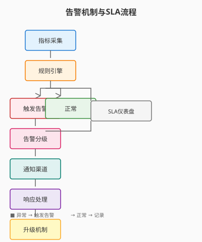

# Day 27｜告警机制与SLA口径

## 今日主题

**告警机制与SLA口径**：建立可量化的服务等级协议（SLA），通过多级告警策略实现「问题早发现、快定位、可回溯」。

## 技术原理（技术视角）

### 核心机制

- **指标采集（Metric Collection）**：定时采集关键指标（响应时间、错误率、成功率、资源使用率），支持 Push（Agent主动上报）或 Pull（Gateway定时拉取）两种模式
- **告警规则引擎（Alert Rule Engine）**：基于阈值、同比环比、连续性检测触发告警，支持 AND/OR 组合条件
- **告警分级（Alert Triage）**：按严重程度分为 P0-P3 四级，对应不同的响应时效和通知渠道
- **告警聚合（Alert Aggregation）**：相同根因的告警自动聚合，避免告警风暴；支持静默（Silence）和升级（Escalation）

### 关键组件

| 组件 | 职责 | 关键配置 |
|------|------|----------|
| `alert:metric` | 定义采集指标 | `name`, `source`, `interval`, `aggregation` |
| `alert:rule` | 告警触发规则 | `condition`, `threshold`, `window`, `cooldown` |
| `alert:channel` | 通知渠道 | `type` (email/slack/telegram/webhook), `receiver` |
| `alert:triage` | 告警分级与聚合 | `level`, `group_by`, `silence_period` |

### 常见失败点

1. **阈值设置不当**：过严→告警疲劳；过松→错过问题→需按业务节奏迭代调整
2. **告警风暴**：单一故障触发 N 条告警→需配置聚合规则 + 静默策略
3. **告警无人跟进**：发了但没人处理→需配套值班制度和升级机制

## 业务翻译（业务视角）

### 这项能力解决的核心问题

- **问题发现滞后**：用户报障了运维才知道→被动救火
- **SLA 承诺无法量化**：说「99.9%可用」但不知道怎么算→缺乏公信力
- **告警无人处理**：发了→没人看→逐渐麻木→失去意义

### 对效率/质量/速度/可控的影响

| 维度 | 价值 | 量化参考 |
|------|------|----------|
| 效率 | 自动化监控替代人工巡检 | 巡检耗时从 2h/天 → 5min/天 |
| 质量 | SLA 可量化、可审计 | 客户投诉下降 50%+ |
| 速度 | MTTR（Mean Time To Recovery）缩短 | 从小时 → 分钟 |
| 可控 | 告警可追溯、责任到人 | 响应时效提升 60%+ |

## 典型场景（个人版）

1. **接口异常告警**：API 错误率 > 1% 持续 5 分钟 → 触发 P1 告警 → 通知值班 → 15 分钟内未解决自动升级
2. **资源告警**：CPU 使用率 > 80% 持续 10 分钟 → 触发 P2 告警 → 通知基础设施负责人
3. **SLA 仪表盘**：月度 SLA 达成率自动统计 → 生成可分享报告 → 客户对账依据

## 官方资料（带看点）

### 本地文档（知识库镜像路径）

- `../../官方文档-本地镜像(节选)/可观测性与日志分析.md` — 看点：日志采集 + 指标告警联动
- `../../官方文档-本地镜像(节选)/任务调度与定时任务.md` — 看点：定时采集与告警触发

### 在线文档

- https://docs.openclaw.ai/core-concepts — 核心概念全景
- https://docs.openclaw.ai/operation/alerting — 告警配置最佳实践

## 图示

> 图注：手绘风格，单线框，箭头清晰可见。移动端友好布局。

## 管理者关注点（成本/效率/风险）

| 关注点 | 说明 |
|--------|------|
| **成本** | 告警平台资源 + 值班人力成本 vs 故障损失成本 |
| **效率** | MTTR 缩短、告警抑制减少无效响应、SLA 可量化 |
| **风险** | 告警疲劳（阈值过松）、告警漏报（阈值过严）、升级超时 |
| **治理** | 告警收敛、值班轮换、SLA 定期回顾（季度） |

## 本日自检

- [ ] 我是否能画出「指标采集 → 规则匹配 → 告警触发 → 通知 → 升级」的完整链路？
- [ ] 我是否能说清 P0-P3 四级告警的区分标准及响应时效要求？
- [ ] 我是否知道如何配置「告警聚合」避免告警风暴？
- [ ] 我是否能列举 3 个常见告警配置失败场景及应对策略？

## 一句话总结

告警是「让系统自己说话」—— 把不可见的问题变成可跟进的卡片，把模糊的承诺变成可量化的 SLA。
