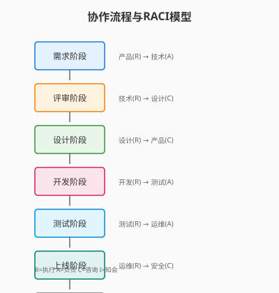

# Day 28｜协作流程与RACI模型

## 今日主题

**协作流程与RACI模型**：用责任分配矩阵（RACI）明确「谁在什么阶段该干什么」，让跨角色协作从「靠默契」变成「有章法」。

## 技术原理（技术视角）

### 核心机制

- **RACI 矩阵定义**：将任务拆解为动作项，按「Responsible（执行）、Accountable（负责）、Consulted（咨询）、Informed（知会）」四类定义角色职责
- **阶段门禁（Stage Gate）**：每个阶段设置明确的入口条件和出口标准，只有满足条件才能进入下一阶段
- **状态同步（State Sync）**：任务状态变更时自动同步到 RACI 中定义的相关角色，支持多端查看
- **冲突仲裁（Conflict Resolution）**：当 A 与 B 职责交叉或空档时，由「Accountable」角色仲裁

### 关键组件

| 组件 | 职责 | 关键配置 |
|------|------|----------|
| `collab:matrix` | 定义 RACI 矩阵 | `task`, `roles`, `raci_code` |
| `collab:stage` | 定义阶段门禁 | `entry_condition`, `exit_criteria` |
| `collab:sync` | 状态同步 | `triggers`, `channels` |
| `collab:conflict` | 冲突处理 | `escalation_path`, `仲裁规则` |

### 常见失败点

1. **RACI 变成 RRRR**：全员负责 = 没人负责 → 需明确唯一的 A（Accountable）
2. **阶段门禁形同虚设**：口头说「可以了」就放行 → 需设置可自动化校验的入口条件
3. **角色定义模糊」：运维既要做执行又要审批 → 需分离不相容职责

## 业务翻译（业务视角）

### 这项能力解决的核心问题

- **协作靠吼**：遇到问题问一圈不知道找谁→责任不明确
- **流程随意**：跳过阶段直接「先上线再说」→缺乏质量门禁
- **信息孤岛**：下游不知道上游完成了什么→缺乏状态同步

### 对效率/质量/速度/可控的影响

| 维度 | 价值 | 量化参考 |
|------|------|----------|
| 效率 | 减少「该找谁」的沟通成本 | 协作定位时间从小时 → 分钟 |
| 质量 | 阶段门禁确保每个环节可审计 | 返工率下降 40%+ |
| 速度 | 并行任务明确边界，减少等待 | 端到端交付周期缩短 20%+ |
| 可控 | RACI 可追溯，责任到人 | 事故定责时间从天 → 小时 |

## 典型场景（个人版）

1. **需求评审流程**：产品（R）写需求 → 技术（A）评审 → 设计（C）确认 → 全员（I）知会评审结果
2. **上线发布流程**：开发（R）提交 → 测试（A）验收 → 运维（R）部署 → 安全（C）审核 → 全员（I）知会上线结果
3. **故障响应流程**：报警（R）处理 → 值班（A）决策 → 架构师（C）指导 → Leader（I）知会故障进展

## 官方资料（带看点）

### 本地文档（知识库镜像路径）

- `../../官方文档-本地镜像(节选)/任务协作与工作流.md` — 看点：多角色协作与状态机
- `../../官方文档-本地镜像(节选)/权限控制与角色管理.md` — 看点：角色定义与权限映射

### 在线文档

- https://docs.openclaw.ai/core-concepts — 核心概念全景
- https://docs.openclaw.ai/skill-developer/workflow — 工作流设计模式

## 图示

> 图注：手绘风格，单线框，箭头清晰可见。移动端友好布局。

## 管理者关注点（成本/效率/风险）

| 关注点 | 说明 |
|--------|------|
| **成本** | RACI 维护成本 vs 协作摩擦成本 |
| **效率** | 阶段门禁减少返工、信息同步减少追问 |
| **风险** | 角色空档（A 未定义）、职责重叠（多人 R） |
| **治理** | 季度 RACI 回顾、角色轮换、阶段门禁审计 |

## 本日自检

- [ ] 我是否能画出「阶段 → 门禁 → 角色 → 状态同步」的完整流程？
- [ ] 我是否能说清 RACI 四类角色的区别及典型配置？
- [ ] 我是否知道如何设置可自动化校验的阶段门禁条件？
- [ ] 我是否能列举 3 个常见 RACI 配置失败场景及应对策略？

## 一句话总结

RACI 是协作的「交通规则」—— 让人找对人、事对事、责对责。
