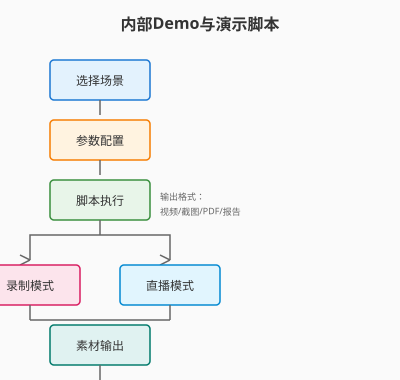

# Day 29｜内部Demo与演示脚本

## 今日主题

**内部Demo与演示脚本**：把技术能力转化为「可看、可信、可复现」的演示素材，让想法落地为能被他人快速理解的展示内容。

## 技术原理（技术视角）

### 核心机制

- **场景脚手架（Scenario Scaffold）**：预设多种典型演示场景模板（功能演示、极限演示、对比演示），一键初始化
- **参数化输入（Parametric Input）**：演示脚本支持外部参数注入（用户ID、时间范围、场景标签），同一脚本不同场景复用
- **录制与回放（Record & Replay）**：支持全流程录制、关键步骤截图、异常节点日志保存，形成可追溯的演示证据
- **多端适配（Multi-endpoint）**：脚本输出适配不同展示终端（大屏投屏、手机录屏、PDF 报告）

### 关键组件

| 组件 | 职责 | 关键配置 |
|------|------|----------|
| `demo:scenario` | 定义演示场景 | `name`, `steps`, `params`, `expected` |
| `demo:runner` | 执行演示脚本 | `mode` (live/record/replay), `speed` |
| `demo:capture` | 采集演示证据 | `screenshots`, `logs`, `video`, `metrics` |
| `demo:output` | 输出展示素材 | `format`, `template`, `branding` |

### 常见失败点

1. **演示现场翻车」：网络不稳、环境不一致→需支持离线录制 + 多次彩排模式
2. **演示过程冗长」：客户时间有限→需前置「电梯演讲」版本（30秒版 vs 30分钟版）
3. **无法复现」：演示效果依赖特定数据→需内置模拟数据 + 参数化切换

## 业务翻译（业务视角）

### 这项能力解决的核心问题

- **说服成本高**：技术方案「很好但看不见」→ 需要可展示的证据链
- **每次从头讲」：同一个功能换不同人讲不同版本→ 需要标准化脚本
- **演示一次过」：客户想复看但找不到录像→ 需要可归档、可检索的演示库

### 对效率/质量/速度/可控的影响

| 维度 | 价值 | 量化参考 |
|------|------|----------|
| 效率 | 演示准备时间从小时 → 分钟 | 准备时间缩短 80%+ |
| 质量 | 演示内容标准化，质量一致 | 演示通过率提升 50%+ |
| 速度 | 新人也能快速上手讲产品 | 上手周期从周 → 天 |
| 可控 | 演示版本可追溯、可审计 | 演示事故率下降 70%+ |

## 典型场景（个人版）

1. **客户拜访 Demo」：用参数化脚本快速切换「看功能」vs「看性能」vs「看安全」三个版本
2. **内部评审 Demo」：录制完整操作路径，评审会上回放并标注关键决策点
3. **展会 Live Demo」：预设「正常流程」+「异常恢复」两套脚本，现场灵活切换

## 官方资料（带看点）

### 本地文档（知识库镜像路径）

- `../../官方文档-本地镜像(节选)/Skill封装与复用.md` — 看点：如何将 Demo 封装为可复用 Skill
- `../../官方文档-本地镜像(节选)/Browser自动化与录制.md` — 看点：自动化录制与回放

### 在线文档

- https://docs.openclaw.ai/core-concepts — 核心概念全景
- https://docs.openclaw.ai/skill-developer/best-practice — 最佳实践

## 图示

> 图注：手绘风格，单线框，箭头清晰可见。移动端友好布局。

## 管理者关注点（成本/效率/风险）

| 关注点 | 说明 |
|--------|------|
| **成本** | 脚本开发成本 vs 销售周期缩短带来的收益 |
| **效率** | 演示准备效率、版本切换效率 |
| **风险** | 演示数据泄露、演示翻车影响成交 |
| **治理** | 演示脚本版本管理、演示效果定期回顾 |

## 本日自检

- [ ] 我是否能画出「场景定义 → 参数化 → 执行录制 → 素材输出」的完整流程？
- [ ] 我是否能说清「30秒版」vs「30分钟版」Demo 的核心差异及适用场景？
- [ ] 我是否知道如何配置「异常恢复」脚本以应对演示翻车？
- [ ] 我是否能列举 3 个常见 Demo 失败场景及应对策略？

## 一句话总结

Demo 是技术的「门面」—— 把复杂的技术变成可看、可信、可复现的商业说服力。
